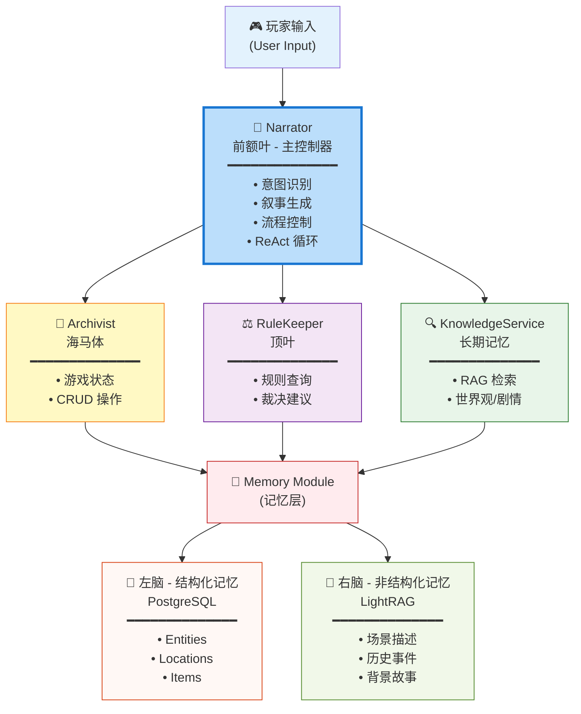

# GlyphKeeper（符语者）

> **Call of Cthulhu (克苏鲁的呼唤)** is a Trademark of Chaosium Inc.
>
> This project is a **Fan Work** created under Chaosium's [Fan Use Policy](https://www.chaosium.com/fan-use-and-licensing/). It is not an official product and is not endorsed by Chaosium Inc.
>
> 本项目遵循 Chaosium 的爱好者使用政策。GlyphKeeper 仅提供**跑团辅助系统的代码逻辑**，不自带任何《克苏鲁的呼唤》规则书原文或官方模组数据。使用者需自行导入合法的规则数据。

### 基于多代理与持久化状态的 AI COC7版规则跑团守密人系统

> **核心理念**：通过多智能体协作与双脑式记忆架构，解决 LLM 在长程叙事中的灾难性遗忘与角色悖论问题

## 📖 项目简介

**GlyphKeeper** 是一个为《克苏鲁的呼唤》桌面角色扮演游戏设计的智能守密人（Keeper）系统。它采用**多智能体协作架构**和**双脑式记忆系统**，通过将 AI 守密人的职责拆解为多个专业化代理，实现了高质量的长程叙事和规则裁决能力。

传统的"单体 LLM + 提示词工程"方案存在根本性矛盾：同一个模型既要发挥创造性进行叙事，又要严格维护游戏状态和规则，这导致了记忆混乱和逻辑冲突。本项目受 **Google DeepMind Concordia** 框架与 **ChatRPG v2** 论文启发，通过**关注点分离** 原则，将守密人的能力分解为协同工作的多个专业代理，并基于**持久化数据库**构建单一事实来源。

## 🎯 核心痛点与解决方案

| 痛点 | 传统 LLM 方案的问题 | GlyphKeeper 解决方案 |
| --- | --- | --- |
| **记忆遗忘** | 依赖有限的 Context Window，随对话变长必然遗忘 | **双脑式记忆架构**：结构化数据存储在 PostgreSQL，非结构化叙事存储在基于 LightRAG 的向量/图数据库 |
| **角色冲突** | 单个模型既要"创造性叙事"又要"严格维护状态" | **多智能体分工**：Narrator 负责创作，Archivist 负责数据维护，RuleKeeper 负责规则裁决 |
| **逻辑不一致** | LLM 凭空编造或记忆错乱（如：搜索过的房间重复刷新物品） | **单一事实来源**：所有游戏状态持久化到数据库，LLM 只作为"执行器"而非"存储器" |
| **规则混淆** | LLM 虚构或混淆 CoC 规则（如：错误的孤注一掷判定） | **RAG 规则检索**：RuleKeeper 通过向量检索查询规则书，提供准确的裁决建议 |

---

## 🏗️ 系统架构

### 多智能体协作设计

本系统采用**脑科学隐喻**，将守密人的职责映射到不同的"认知功能区"：



### 核心代理说明

#### 1. Narrator - 叙事引擎 🎭

**文件位置**: [src/agents/narrator.py](src/agents/narrator.py)

**职责**：
- 作为主控制器，接收玩家输入（通过 `NarratorInput` 结构化输入）并解析意图
- 通过 ReAct（推理-行动-观察）循环进行决策，支持**多轮工具调用**
- 调用 Archivist（9个工具）、RuleKeeper 等获取信息和执行操作
- 生成沉浸式的洛夫克拉夫特风格叙事文本

**核心能力**：
- **XML 结构化 Prompt**（通过 `PromptAssembler`）
- **循环防护机制**（最多 5 轮工具调用 + 重复调用检测）
- 流式输出生成（支持异步流）
- 工具调用编排（OpenAI Function Calling）
- 场景模式切换（探索/战斗/对话/调查）
- LLM 追踪日志（记录所有调用到 `logs/llm_traces.jsonl`）

#### 2. Archivist - 数据守门人 📜

**文件位置**: [src/agents/archivist.py](src/agents/archivist.py)

**职责**：
- 封装所有游戏状态的 CRUD 操作为**9个原子化工具**
- 实现复杂逻辑（BFS 自动寻路、状态自动更新等）
- 确保数据的一致性和幂等性
- 提供 LLM 友好的 JSON 格式返回

**核心工具**（共 9 个）：
```python
# 游戏状态查询
get_game_session_stat(session_id)             # 会话信息（时间、节拍、全局标签）
list_investigators(session_id)                # 调查员列表

# 场景交互
get_location_stat(entity_name)                # 当前场景完整信息
inspect_target(viewer_name, target_name)      # 详细检查目标，触发线索发现

# 双移动系统
move_entity(entity_name, direction)           # 【战术移动】短距离相邻移动
travel_to_location(entity_name, target_ref)   # 【叙事旅行】BFS 自动寻路

# 状态管理
get_entity_status(entity_name)                # 实体属性（HP/SAN/MP/tags）
update_entity_resource(entity, resource, delta) # 更新资源，自动处理阈值
add_entity_tag(entity_name, tags)             # 批量添加状态标签

# 物品 & 知识
transfer_item(item, from, to)                 # 物品转移
recall_knowledge(entity_name, query)          # RAG 知识检索
```

#### 3. RuleKeeper - 规则裁判 ⚖️

**文件位置**: [src/agents/rule_keeper.py](src/agents/rule_keeper.py)

**职责**：
- 通过 RAG 检索 CoC 7版规则书内容
- 结合当前游戏情境给出裁决建议
- 防止 Narrator 凭空编造或混淆规则

**典型使用场景**：
- 玩家请求"孤注一掷"（Push the roll）
- 战斗轮次和伤害计算
- 理智值检定（SAN check）与疯狂症状
- 技能成长与角色发展

#### 4. PromptAssembler - 提示词构建器 🏗️

**文件位置**: [src/agents/assembler.py](src/agents/assembler.py)

**职责**：
- 实现**XML 结构化上下文**的动态提示词生成
- 将游戏状态、记忆、历史整合为多层结构
- 支持场景模式自动检测

**多层提示词架构**（使用 XML 标签分隔）：

```xml
<系统指令层>
  核心法则：绝对真实、玩家自主权、洛夫克拉夫特风格、内容安全
</系统指令层>

<world_state>
  时间、地点、调查员、环境标签
</world_state>

<knowledge_base>
  <lore>语义记忆</lore>
  <history>情节记忆</history>
  <keeper_notes>守密人笔记</keeper_notes>
</knowledge_base>

<conversation_history>
  最近对话历史
</conversation_history>

<observation>
  工具调用结果
</observation>
```

**关键特性**：
- XML 结构化增强 LLM 理解能力
- 自动场景模式检测（探索/战斗/对话/调查）
- 内容安全规则内置

---

## 💾 记忆系统：双脑架构

详细架构请参阅 [src/memory/README.md](src/memory/README.md)

### 左脑 - 结构化记忆 (PostgreSQL)

负责存储精确的、逻辑严密的游戏数据：

**核心数据模型** ([src/memory/models.py](src/memory/models.py))：
- **Location**: 地点及其连接关系
- **Entity**: 玩家、NPC、怪物（包含属性、状态、战斗数据）
- **Interactable**: 物理容器（箱子、门、尸体等）
- **ClueDiscovery**: 线索发现的中间层（支持多对多映射）
- **Knowledge**: 逻辑开关，指向 LightRAG 中的具体知识内容
- **GameSession**: 全局游戏状态（时间、节拍、存档点）

**数据访问层** ([src/memory/repositories/](src/memory/repositories/))：
- 基于 Repository 模式封装的类型安全接口
- 支持标签 (Tag) 系统实现条件性内容解锁

### 右脑 - 非结构化记忆 (LightRAG)

负责存储模糊的、联想性的叙事内容：

**技术栈**：
- **LightRAG-HKU**: 图谱增强的 RAG 引擎
- **pgvector**: PostgreSQL 向量扩展，存储文本嵌入
- **NetworkX**: 图数据库，存储实体关系网络

**核心功能**：
- **情景记忆** ([src/memory/episodic_memory.py](src/memory/episodic_memory.py))：记录游戏过程中发生的事件
- **语义记忆** ([src/memory/semantic_memory.py](src/memory/semantic_memory.py))：存储模组的背景故事和设定
- **元数据注入**：将结构化 Tag 注入到文本中，增强检索相关性

---

## 🛠️ 技术栈

### 核心依赖

| 组件 | 技术 | 说明 |
|------|------|------|
| **编程语言** | Python 3.12+ | 利用现代异步特性 |
| **LLM 集成** | OpenAI-compatible API | 支持 OpenAI / Azure OpenAI / 兼容接口 |
| **数据库** | PostgreSQL + pgvector | 关系型数据 + 向量检索 |
| **ORM** | SQLAlchemy 2.0 | 异步 ORM |
| **RAG 引擎** | LightRAG-HKU | 图谱增强的高级 RAG |
| **配置管理** | PyYAML + Pydantic | 类型安全的配置系统 |
| **日志系统** | Python logging | 结构化日志记录 |
| **包管理** | uv | 快速的现代 Python 包管理器 |

### LLM 分级调用策略

为了平衡性能和成本，系统支持**三级模型配置**：

| 等级 | 用途 | 示例场景 |
|------|------|----------|
| **fast** | 快速响应、简单任务 | 意图识别、是/否判断 |
| **standard** | 常规叙事 | 场景描述、NPC 对话 |
| **smart** | 复杂推理 | 关键剧情决策、规则裁决 |

配置文件位置：[config.yaml](config.yaml)

---

## 🚀 快速开始

### 1. 环境准备

**系统要求**：
- Python 3.12 或更高版本
- PostgreSQL 16+ (需安装 pgvector 扩展)
- 4GB+ 可用内存

**安装步骤**：

```bash
# 1. 克隆项目
git clone https://github.com/yourusername/GlyphKeeper.git
cd GlyphKeeper

# 2. 安装 uv（推荐的包管理器）
pip install uv

# 3. 安装项目依赖
uv sync

# 4. 配置文件
cp template/config.yaml.template config.yaml
cp template/providers.ini.template providers.ini
```

### 2. 配置系统

**编辑 `config.yaml`**：

```yaml
project:
  name: "GlyphKeeper"
  active_world: "my_game"        # 当前激活的世界/模组
  model_usage_logging: true      # 启用 Token 使用统计

database:
  host: "localhost"
  port: "5432"
  username: "your_db_user"
  password: "your_db_password"
  project_name: "GlyphKeeper"

model_tiers:
  fast: "gpt-4o-mini"
  standard: "gpt-4o"
  smart: "gpt-4o"
```

**编辑 `providers.ini`** 填入 LLM API 密钥：

```ini
[openai]
base_url = https://api.openai.com/v1
api_key = sk-your-api-key-here
```

### 3. 初始化数据库

```bash
# 初始化数据库表结构
uv run python scripts/init_db.py

# (可选) 查看可用的世界管理命令
uv run python scripts/manage_worlds.py --help
```

### 4. 导入模组数据

```bash
# 导入 PDF 格式的模组文件
uv run python scripts/ingest_module.py path/to/your_module.pdf

# 或使用交互式导入
uv run python src/interfaces/cli_runner.py
```

### 5. 运行系统

**方式 A：命令行交互模式**
```bash
uv run python src/interfaces/cli_runner.py
```

**方式 B：启动 API 服务**
```bash
# 启动 FastAPI 服务器（开发中）
uv run python -m src.interfaces.api_server
```

---

## 📁 项目结构

```
GlyphKeeper/
├── config.yaml              # 主配置文件
├── providers.ini            # LLM 提供商配置
├── pyproject.toml           # 项目依赖管理
│
├── data/                    # 数据目录
│   ├── worlds/              # 世界/模组存档（每个世界独立子目录）
│   ├── modules/             # 原始模组文件
│   ├── rules/               # 规则书数据
│   └── tmp/                 # 临时文件
│
├── logs/                    # 日志目录
│   └── llm_usage.jsonl      # LLM Token 使用统计
│
├── scripts/                 # 工具脚本
│   ├── init_db.py           # 初始化数据库
│   ├── manage_worlds.py     # 世界管理（创建/切换/删除）
│   ├── ingest_module.py     # 导入模组
│   └── inspect_graph.py     # 检查 RAG 图谱
│
├── src/                     # 源代码
│   ├── agents/              # 多智能体系统
│   │   ├── narrator.py      # 叙事引擎
│   │   ├── archivist.py     # 数据守门人
│   │   ├── rule_keeper.py   # 规则裁判
│   │   ├── assembler.py     # 提示词构建器
│   │   └── tools/           # 代理工具集
│   │       ├── knowledge_service.py  # 知识检索服务
│   │       └── db_tools.py           # 数据库工具
│   │
│   ├── memory/              # 记忆系统
│   │   ├── models.py        # 数据模型定义
│   │   ├── database.py      # 数据库连接管理
│   │   ├── RAG_engine.py    # RAG 引擎封装
│   │   ├── episodic_memory.py   # 情景记忆
│   │   ├── semantic_memory.py   # 语义记忆
│   │   └── repositories/    # 数据访问层
│   │       ├── entity_repo.py
│   │       ├── location_repo.py
│   │       └── ...
│   │
│   ├── llm/                 # LLM 集成层
│   │   ├── llm_factory.py   # LLM 工厂
│   │   ├── llm_base.py      # 基础接口
│   │   └── llm_openai.py    # OpenAI 兼容实现
│   │
│   ├── ingestion/           # 数据摄入模块
│   │   ├── loader.py        # 文件加载器
│   │   ├── pdf_parser.py    # PDF 解析
│   │   └── structure_extractor.py  # 结构化提取
│   │
│   ├── interfaces/          # 接口层
│   │   ├── cli_runner.py    # 命令行界面
│   │   └── api_server.py    # REST API 服务（开发中）
│   │
│   ├── core/                # 核心功能
│   │   ├── config.py        # 配置管理
│   │   └── logger.py        # 日志系统
│   │
│   └── utils/               # 工具类
│       └── token_tracker.py # Token 统计
│
├── tests/                   # 测试与演示
└── template/                # 配置文件模板
    ├── config.yaml.template
    └── providers.ini.template
```

---

## 💡 工作流示例

### 场景 1：动态线索发现

**背景**：玩家搜索书桌，但关键道具"日记"原本放置在床下。系统动态调整剧情，奖励玩家的合理探索。

```
玩家输入: "我仔细翻找书桌的抽屉。"

[Narrator 内部推理]
Think: 玩家在搜索书桌，需要查询：
      1. 书桌的状态（是否被搜索过）
      2. 日记的位置（预设在床垫下）

Action: 调用 Archivist.get_location_view("玩家")
        调用 Archivist.inspect_target("玩家", "书桌")

Observation: {
  "desk": {"searched": false},
  "diary": {"location": "bed_mattress", "discovered": false}
}

Think: 书桌尚未搜索过，玩家的行为合理。
       为了流畅性，可以将日记移到这里。

Action: 调用 Archivist.discover_clue("玩家", "书桌", "diary")

Narrator 输出: 
"你拉开书桌的第三个抽屉，在一堆陈旧的账本后面，
发现了一本皮质封面的日记。泛黄的纸页散发出霉味。"
```

### 场景 2：规则裁决

**背景**：玩家在技能检定失败后请求"孤注一掷"，Narrator 需要查询规则书确认条件。

```
玩家输入: "我要孤注一掷！重投这个技能检定！"

[Narrator 内部推理]
Think: 玩家请求 Push the roll，需要确认规则条件

Action: 调用 RuleKeeper.consult_rulebook(
          query="孤注一掷的使用条件和后果",
          context="玩家刚在图书馆使用检定失败"
        )

RuleKeeper 返回:
"根据 CoC 7版规则，孤注一掷需满足：
1. 初次检定失败
2. KP 同意（情境合理）
3. 失败后果更严重
当前情境：在图书馆搜索书籍，可以允许，但失败会惊动管理员。"

Think: 规则允许，但需要设置更高风险

Action: 调用 Archivist.update_entity_state(
          "玩家", 
          {"status": "pushing_roll", "risk_level": "high"}
        )

Narrator 输出:
"你决定孤注一掷。你开始翻找更深层的书架，
发出了些许声响。请进行第二次图书馆使用检定，
难度不变，但如果失败，管理员会察觉你的行为。"
```

---

## 🔧 常用命令

### 世界管理

```bash
# 列出所有世界
uv run python scripts/manage_worlds.py list

# 创建新世界
uv run python scripts/manage_worlds.py create --name "诡宅疑云"

# 切换激活世界
uv run python scripts/manage_worlds.py switch --name "诡宅疑云"

# 删除世界
uv run python scripts/manage_worlds.py delete --name "old_world"
```

### 数据管理

```bash
# 查看数据库表
uv run python scripts/create_tables.py

# 检查 RAG 图谱
uv run python scripts/inspect_graph.py

# 查看 Token 使用统计
uv run python scripts/print_usage_summary.py

# 重置所有数据（谨慎使用）
uv run python scripts/reset_all_data.py
```

### 开发调试

```bash
# 运行单元测试
uv run pytest tests/

# 测试 LLM 连接
uv run python tests/test_llm_tools.py

# 测试记忆系统
uv run python tests/demo_memory_check.py

# 测试 Narrator
uv run python tests/demo_narrator.py
```

---

## 📝 配置说明

### config.yaml 核心配置项

```yaml
project:
  name: "GlyphKeeper"
  active_world: "my_campaign"          # 当前激活的世界
  model_usage_logging: true            # 启用 Token 统计
  model_usage_log_path: "logs/llm_usage.jsonl"

database:
  host: "localhost"
  port: "5432"
  username: "postgres"
  password: "your_password"
  project_name: "GlyphKeeper"

# 三级模型配置
model_tiers:
  fast: "gpt-4o-mini"       # 快速响应
  standard: "gpt-4o"        # 常规叙事
  smart: "gpt-4o"           # 复杂推理

# 模型详细配置
models:
  gpt-4o-mini:
    provider: "openai"
    model_name: "gpt-4o-mini"
    temperature: 0.7
    max_tokens: 2000

  gpt-4o:
    provider: "openai"
    model_name: "gpt-4o"
    temperature: 0.8
    max_tokens: 4000

# RAG 配置
rag_settings:
  top_k: 60                  # 检索文档数量
  mode: "hybrid"             # 检索模式: local/global/hybrid/mix
  enable_llm: true           # 是否使用 LLM 重排序
```

---


### 开发环境设置

```bash
# Fork 并克隆仓库
git clone https://github.com/your-username/GlyphKeeper.git
cd GlyphKeeper

# 创建开发分支
git checkout -b feature/your-feature-name

# 安装开发依赖
uv sync --dev

# 运行测试确保环境正常
uv run pytest tests/
```

---

## ⚠️ 免责声明

1. **版权声明**：
   - 本项目是基于 Chaosium Inc. 的粉丝使用政策创建的爱好者作品
   - 不包含任何受版权保护的官方内容（规则书原文、模组文本等）
   - 用户需自行获取合法的规则书和模组资料

2. **使用限制**：
   - 本软件仅供个人学习和非商业用途
   - 请勿用于任何商业活动或盈利目的
   - 遵守当地法律法规

3. **免责条款**：
   - 软件按"原样"提供，不提供任何明示或暗示的保证
   - 作者不对使用本软件造成的任何损失负责
   - 用户需自行承担使用风险

---

## 📄 许可证

本项目采用 [Apache 2.0 License](LICENSE)。

---

## 🙏 致谢

- [Chaosium Inc.](https://www.chaosium.com/) - 创造了精彩的 Call of Cthulhu 游戏
- [LightRAG-HKU](https://github.com/HKUDS/LightRAG) - 强大的图谱增强 RAG 引擎
- [Google DeepMind Concordia](https://github.com/google-deepmind/concordia) - 多智能体架构灵感来源
- [ChatRPG v2](https://arxiv.org/abs/2210.03620) - 理论基础参考
- [Google Gemini](https://gemini.google.com/) - 提供代码编写协助与结对编程支持

---

**⭐ 如果本项目对你有帮助，欢迎 Star 支持！**
