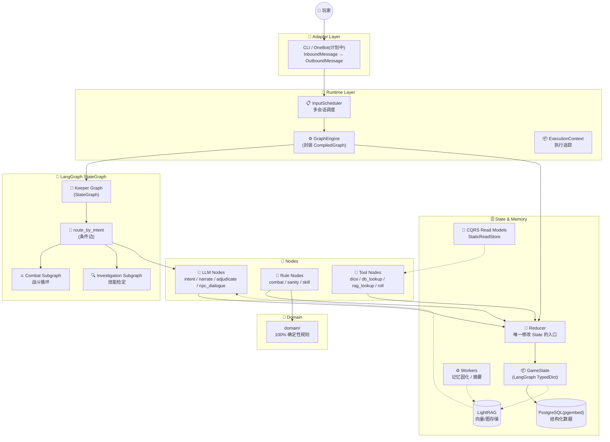
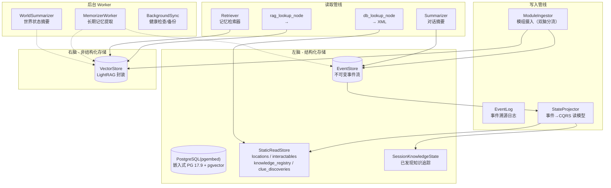

# GlyphKeeper（符语者）

> **Call of Cthulhu (克苏鲁的呼唤)** is a Trademark of Chaosium Inc.
>
> This project is a **Fan Work** created under Chaosium's [Fan Use Policy](https://www.chaosium.com/fan-use-and-licensing/). It is not an official product and is not endorsed by Chaosium Inc.
>
> 本项目遵循 Chaosium 的爱好者使用政策。GlyphKeeper 仅提供**跑团辅助系统的代码逻辑**，不自带任何《克苏鲁的呼唤》规则书原文或官方模组数据。使用者需自行导入合法的规则数据。

### 基于 LangGraph 图编排与事件溯源的 AI COC7版规则跑团守密人系统

> **核心理念**：通过 LangGraph StateGraph 图编排与双脑式记忆架构，解决 LLM 在长程叙事中的灾难性遗忘与角色悖论问题

## 📖 项目简介

**GlyphKeeper** 是一个为《克苏鲁的呼唤》桌面角色扮演游戏设计的智能守密人（Keeper）系统。它采用 **LangGraph StateGraph 图编排架构**和**双脑式记忆系统**，通过将 AI 守密人的职责拆解为多个专业化 Node，实现了高质量的长程叙事和规则裁决能力。

传统的"单体 LLM + 提示词工程"方案存在根本性矛盾：同一个模型既要发挥创造性进行叙事，又要严格维护游戏状态和规则，这导致了记忆混乱和逻辑冲突。本项目受 **Google DeepMind Concordia** 框架与 **ChatRPG v2** 论文启发，通过**关注点分离** 原则，将守密人的能力分解为协同工作的多个专业 Node，并基于**事件溯源（Event Sourcing）** 构建单一事实来源。

## 🎯 核心痛点与解决方案

| 痛点 | 传统 LLM 方案的问题 | GlyphKeeper 解决方案 |
| --- | --- | --- |
| **记忆遗忘** | 依赖有限的 Context Window，随对话变长必然遗忘 | **双脑式记忆架构**：结构化数据存储在 PostgreSQL（CQRS 读模型），非结构化叙事存储在基于 LightRAG 的向量/图数据库 |
| **角色冲突** | 单个模型既要"创造性叙事"又要"严格维护状态" | **Node 分工**：LLM Nodes 负责创作，Rule Nodes 负责裁决，Reducer 唯一修改状态 |
| **逻辑不一致** | LLM 凭空编造或记忆错乱（如：搜索过的房间重复刷新物品） | **事件溯源**：所有状态变更为不可变 Event，Engine → Reducer 维护一致性，LLM 只读不写 |
| **规则混淆** | LLM 虚构或混淆 CoC 规则（如：错误的孤注一掷判定） | **确定性规则内核**：`domain/` 层 100% 无 LLM 逻辑；`nodes/rules/` 纯 Python 裁决 |

---

## 🏗️ 系统架构

GlyphKeeper 采用 **4 层架构**，是一个 **LangGraph StateGraph 驱动**的事件驱动系统。

> **核心范式**：`langgraph stategraph + reducer pattern + deterministic game engine + LLM node system`

### 宏观架构全景图


```mermaid
graph TB
    Player((👤 玩家))

    subgraph "🔌 Adapter Layer"
        Adapter["CLI / OneBot(计划中)<br/>InboundMessage → OutboundMessage"]
    end

    subgraph "🧠 Runtime Layer"
        Engine["⚙️ GraphEngine<br/>(封装 CompiledGraph)"]
        Scheduler["📋 InputScheduler<br/>多会话调度"]
        Ctx["📦 ExecutionContext<br/>执行追踪"]
    end

    subgraph "🔁 LangGraph StateGraph"
        Keeper["👤 Keeper Graph<br/>(StateGraph<GameState>)"]
        Router["🔄 route_by_intent<br/>(条件边)"]
        Combat["⚔️ Combat Subgraph<br/>战斗循环"]
        Investigate["🔍 Investigation Subgraph<br/>技能检定"]
    end

    subgraph "🧩 Nodes"
        LLMN["🤖 LLM Nodes<br/>intent / narrate / adjudicate / npc_dialogue"]
        RuleN["📐 Rule Nodes<br/>combat / sanity / skill"]
        ToolN["🔧 Tool Nodes<br/>dice / db_lookup / rag_lookup / roll"]
    end

    subgraph "🗄️ State & Memory"
        State["📦 GameState<br/>(LangGraph TypedDict)"]
        Reducer["🔄 Reducer<br/>唯一修改 State 的入口"]
        PG[("PostgreSQL(pgembed)<br/>结构化数据")]
        RAG[("LightRAG<br/>向量/图存储")]
        Workers["⚙️ Workers<br/>记忆固化 / 摘要"]
        CQRS["📖 CQRS Read Models<br/>StaticReadStore"]
    end

    subgraph "🎲 Domain"
        Domain["domain/<br/>100% 确定性规则"]
    end

    Player --> Adapter
    Adapter --> Scheduler
    Scheduler --> Engine
    Engine --> Keeper

    Keeper --> Router
    Router --> Combat
    Router --> Investigate
    Router --> LLMN

    Engine --> Reducer
    LLMN --> Reducer
    RuleN --> Reducer
    ToolN --> Reducer
    Reducer --> State

    State --> PG
    State -.-> RAG
    RAG -.-> LLMN
    Workers -.-> RAG
    CQRS -.-> ToolN
    RuleN --> Domain
```

### 四层详解

| 层级 | 目录 | 职责 |
|------|------|------|
| **🔌 Adapter 层** | `src/adapter/` | 统一接入层，定义 `InboundMessage`/`OutboundMessage` 协议 |
| **🧠 Runtime 层** | `src/runtime/` | 封装 LangGraph CompiledGraph、多会话调度、执行追踪 |
| **🔁 Graph 层** | `src/graph/` | LangGraph StateGraph 拓扑定义，含条件路由与子图 |
| **🧩 Node 层** | `src/nodes/` | 所有可执行能力单元（LLM 节点 / 规则节点 / 工具节点） |
| **🗄️ 数据层** | `src/state/` + `src/memory/` | Event Sourcing + CQRS + 双脑记忆架构 |
| **🎲 域层** | `src/domain/` | 100% 确定性 CoC 规则内核 |
| **🔧 工具层** | `src/tools/` | 外部工具（骰子 / LLM 客户端 / PG 管理 / 配置） |

### 执行流程：双脑路由拓扑

```
玩家输入
    ↓
[Adapter] CLI / OneBot → InboundMessage
    ↓
[Runtime] InputScheduler → GraphEngine
    ↓
[LangGraph] Keeper Graph (StateGraph.ainvoke)
    │
    ├── intent_node (LLM 意图分析 + needs_rag 标记)
    │       ↓
    ├── db_lookup_node (始终执行 — 查 PG 读模型 → <physical_reality> XML)
    │       ↓
    ├── route_by_intent (条件边决定下一跳)
    │   ├──→ combat_subgraph (战斗循环: dice_roll → resolve_combat)
    │   ├──→ investigate_subgraph (技能检定: resolve_skill)
    │   ├──→ npc_dialogue_node (NPC 对话生成)
    │   └──→ → rag_lookup_node (按需查 LightRAG → <semantic_knowledge>)
    │               ↓
    └── narrate_node (LLM 叙事生成)
    ↓
[Reducer] reduce_state(state_patch → new_state)
    ↓
[EventLog] 事件溯源记录
    ↓
[Workers] 后台固化记忆
```

### 执行模式

引擎支持两种模式，默认使用 **langgraph 模式**：

| 模式 | 说明 |
|------|------|
| **langgraph（默认）** | 委托给 `CompiledGraph.ainvoke()`，LangGraph 管理全部流程 |
| **full** | Engine 逐节点手动调度，支持 suspend/resume/retry 控制语义 |

---

## 🗺️ 开发计划

<table>
<tr>
    <th rowspan="15" style="writing-mode:vertical-lr; text-align:center; vertical-align:middle; width:40px; font-weight:bold;">系统框架</th>
    <th>状态</th>
    <th colspan="2" style="text-align:center;">模块与说明</th>
</tr>
<tr><td>✅</td><td colspan="2">CLI适配器，用于简易测试</td></tr>
<tr><td>⬜</td><td colspan="2">Onebot 适配器</td></tr>
<tr><td>✅</td><td colspan="2">统一执行协议</td></tr>
<tr><td>✅</td><td colspan="2">LangGraph引擎，管理图调用与会话生命周期</td></tr>
<tr><td>✅</td><td colspan="2">StateGraph 图编排，条件路由分流意图，子图处理战斗与调查</td></tr>
<tr><td>✅</td><td colspan="2">GameState&WorldManager世界状态管理</td></tr>
<tr><td>🔄</td><td colspan="2">大语言模型云提供方适配</td></tr>
<tr><td>✅</td><td colspan="2">CQRS 读模型表与写入管线</td></tr>
<tr><td>✅</td><td colspan="2">LightRAG 接入</td></tr>
<tr><td>✅</td><td colspan="2">双脑记忆系统</td></tr>
<tr><td>🔄</td><td colspan="2">Worker 后台任务</td></tr>
<tr><td>✅</td><td colspan="2">模组导入系统</td></tr>
<tr><td>⬜</td><td colspan="2">多世界并行与管理</td></tr>
<tr>
    <th rowspan="9" style="writing-mode:vertical-lr; text-align:center; vertical-align:middle; width:40px; font-weight:bold; border-top:2px solid #444;">游戏系统</th>
</tr>
<tr><td>🔄</td><td colspan="2">角色卡系统，职业选择、属性骰点、技能与背景</td>
<tr><td>🔄</td><td colspan="2">调查与线索系统</td></tr>
<tr><td>⬜</td><td style="padding-left:2em;">├ 重复检定请求</td></tr>
<tr><td>⬜</td><td style="padding-left:2em;">├ 无线索时的幻觉问题</td></tr>
<tr><td>🔄</td><td colspan="2">NPC 对话系统</td></tr>
<tr><td>✅</td><td colspan="2">CoC 7版技能检定</td></tr>
<tr><td>⬜</td><td colspan="2">战斗轮与体力系统</td></tr>
<tr><td>⬜</td><td colspan="2">理智与疯狂</td></tr>
<tr><td>🔄</td><td colspan="2">场景切换与 location 更新</td></tr>
<tr><td>⬜</td><td style="padding-left:2em;">├ 场景切换后的新场景描述</td></tr>
<tr><td>⬜</td><td colspan="2">物品背包系统</td></tr>
</table>

> To be continue......

---

## 💾 双脑记忆系统

### 架构总览


```mermaid
graph TB
    subgraph "写入管线"
        Ingestion["ModuleIngestor<br/>模组摄入（双脑分流）"]
        EventLog["EventLog<br/>事件溯源日志"]
        Projector["StateProjector<br/>事件→CQRS 读模型"]
    end

    subgraph "左脑 - 结构化存储"
        ES[("EventStore<br/>不可变事件流")]
        PG[("PostgreSQL(pgembed)<br/>嵌入式 PG 17.9 + pgvector")]
        CQRS["StaticReadStore<br/>locations / interactables<br/>knowledge_registry / clue_discoveries"]
        SKS["SessionKnowledgeState<br/>已发现知识追踪"]
    end

    subgraph "右脑 - 非结构化存储"
        VS[("VectorStore<br/>LightRAG 封装")]
    end

    subgraph "读取管线"
        Retriever["Retriever<br/>记忆检索器"]
        Summarizer["Summarizer<br/>对话摘要"]
        DBLookup["db_lookup_node<br/>→ <physical_reality> XML"]
        RAGLookup["rag_lookup_node<br/>→ <semantic_knowledge>"]
    end

    subgraph "后台 Worker"
        MW["MemorizerWorker<br/>长期记忆提取"]
        WS["WorldSummarizer<br/>世界状态摘要"]
        BS["BackgroundSync<br/>健康检查/备份"]
    end

    Ingestion --> ES
    Ingestion --> VS
    ES --> Projector
    Projector --> CQRS
    Projector --> SKS
    DBLookup --> CQRS
    RAGLookup --> VS
    Retriever --> VS
    Summarizer --> ES
    MW -.-> ES
    MW -.-> VS
    WS -.-> VS
```

### 左脑 - 结构化记忆 (PostgreSQL)

基于 **pgembed** 的嵌入式 PostgreSQL 17.9（自动捆绑，无需系统预装），存储精确的、逻辑严密的游戏数据：

**CQRS 读模型表**（`src/state/read_models.py`）：
- **locations**: 场景定义、出口映射、氛围标签（摄入期写入，运行时只读）
- **interactables**: 可交互物品（书桌、窗户、门等），关联到所属场景
- **knowledge_registry**: 知识本体注册表，`knowledge_id` 是跨系统的逻辑标识符
- **clue_discoveries**: 多对多线索映射，连接物品/NPC 到知识，定义检定条件和发现叙事

**运行时动态表**（`src/state/session_state.py`）：
- **session_knowledge_state**: 玩家会话中已发现的知识追踪，用于防剧透过滤

**EventStore**（`src/memory/event_store.py`）：
- 不可变事件流存储，所有状态变更的权威来源
- 支持基于 version 的增量查询和状态回放

### 右脑 - 非结构化记忆 (LightRAG)

负责存储模糊的、联想性的叙事内容：

**技术栈**：
- **LightRAG-HKU**: 图谱增强的 RAG 引擎
- **pgvector**: PostgreSQL 向量扩展，存储文本嵌入
- **NetworkX**: 图数据库，存储实体关系网络

**接口**（`src/memory/`）：
- `event_store.py` — 事件溯源存储（支持 SQLite 降级和 PostgreSQL 两种后端）
- `vector_store.py` — 向量/图语义检索（LightRAG 封装，关闭 gleaning 减少 API 调用）
- `summarizer.py` — 对话摘要与记忆压缩
- `retriever.py` — Graph Node 的统一记忆输入源

### 模组摄入管线（`src/tools/ingestion.py`）

**双脑分流摄入流程**：
1. **左脑管线**: 解析 intermediate JSON → 写入 EventStore（`WorldInitialized` 事件）→ StateProjector 投影到 CQRS 读模型表
2. **右脑管线**: 合并全局知识和风味文本 → 去重降噪 → 写入 LightRAG（关闭 gleaning）
3. **幂等设计**: 同名模组可重复摄入，不产生重复数据

---

## 🛠️ 技术栈

### 核心依赖

| 组件 | 技术 | 说明 |
|------|------|------|
| **编程语言** | Python 3.12+ | 利用现代异步特性 |
| **Graph 框架** | LangGraph 0.4+ | StateGraph 驱动的 Agent 编排引擎 |
| **LLM 集成** | OpenAI-compatible API (aiohttp) | 直接调用，不依赖第三方 SDK |
| **数据库** | PostgreSQL 17.9 (pgembed 嵌入式) + pgvector | 自动捆绑，无需系统预装 |
| **CQRS 读模型** | asyncpg + 自定义表结构 | locations / interactables / clue_discoveries |
| **RAG 引擎** | LightRAG-HKU | 图谱增强的高级 RAG |
| **配置管理** | PyYAML + Pydantic | 类型安全的配置系统 |
| **日志系统** | Python logging + RotatingFileHandler | 结构化日志，支持分级日志 |
| **包管理** | uv | 快速的现代 Python 包管理器 |

### LLM 分级调用策略

为了平衡性能和成本，系统支持**三级模型配置**：

| 等级 | 用途 | 示例场景 |
|------|------|----------|
| **fast** | 快速响应、简单任务 | 意图识别、是/否判断 |
| **standard** | 常规叙事 | 场景描述、NPC 对话 |
| **smart** | 复杂推理 | 关键剧情决策、规则裁决 |

配置文件位置：[config.yaml](config.yaml)

---

## 📁 项目结构

```
GlyphKeeper/
├── config.yaml              # 主配置文件
├── providers.ini            # LLM 提供商配置
├── pyproject.toml           # 项目依赖管理
├── run_cli.py               # CLI 启动入口
│
├── data/                    # 数据目录
│   ├── worlds/              # 世界/模组存档
│   ├── modules/             # 原始模组文件
│   ├── rules/               # 规则书数据
│   ├── raw_sources/         # 原始来源文件
│   ├── intermediate/        # 摄入中间文件（book.json 等）
│   ├── backups/             # 自动备份
│   └── pg_data/             # pgembed 嵌入式 PostgreSQL 数据
│
├── logs/                    # 日志目录
│   └── llm_usage.jsonl      # LLM Token 使用统计
│
├── scripts/                 # 工具脚本
│   ├── init_db.py           # 初始化数据库
│   ├── manage_worlds.py     # 世界管理
│   ├── ingest_module.py     # 导入模组
│   ├── inspect_graph.py     # 检查 RAG 图谱
│   ├── smoke_test.py        # 冒烟测试
│   └── run_all_tests.py     # 全量测试运行器
│
├── src/                     # 源代码
│   ├── _protocols.py        # 🔷 统一执行协议（核心契约）
│   │                        #    NodeInput / NodeOutput / Event / StatePatch
│   │
│   ├── adapter/             # 🔌 统一接入层
│   │   ├── protocol.py      # InboundMessage / OutboundMessage 协议
│   │   ├── base.py          # AbstractAdapter 基类
│   │   ├── cli.py           # CLI REPL 适配器（含角色创建向导）
│   │   └── onebot.py        # OneBot 11 协议（TODO）
│   │
│   ├── runtime/             # 🧠 执行引擎
│   │   ├── engine.py        # GraphEngine — 封装 LangGraph CompiledGraph
│   │   ├── scheduler.py     # InputScheduler — 多会话调度
│   │   ├── dispatcher.py    # NodeDispatcher — 节点分发与重试
│   │   └── context.py       # ExecutionContext — 执行追踪
│   │
│   ├── state/               # 🗄️ 世界唯一真相（Event Sourcing + CQRS）
│   │   ├── game_state.py    # GameState TypedDict + 视图裁剪
│   │   ├── reducer.py       # State Reducer — 唯一修改 State 的入口
│   │   ├── event_log.py     # EventLog — 事件溯源编排层
│   │   ├── snapshot.py      # 状态快照管理
│   │   ├── world_state.py   # WorldManager — 场景/NPC/物品状态
│   │   ├── player_state.py  # CharacterStore — 角色持久化（PG/JSON 降级）
│   │   ├── module_loader.py # ModuleLoader — 模组载入
│   │   ├── read_models.py   # StaticReadStore — CQRS 读模型表
│   │   ├── projector.py     # StateProjector — 事件→读模型投影
│   │   └── session_state.py # SessionKnowledgeState — 知识发现追踪
│   │
│   ├── graph/               # 🔁 LangGraph StateGraph 定义
│   │   ├── keeper_graph.py       # 守密人主 Graph（双脑路由拓扑）
│   │   ├── combat_graph.py       # 战斗子 Graph（循环拓扑）
│   │   ├── investigation_graph.py # 调查子 Graph（技能检定）
│   │   └── router_graph.py       # route_by_intent 条件边函数
│   │
│   ├── nodes/               # 🧩 执行节点
│   │   ├── llm/             # 🤖 LLM 驱动节点
│   │   │   ├── intent_node.py       # 意图分析（LLM + 规则兜底）
│   │   │   ├── narrator_node.py     # 叙事生成（LLM + 模板兜底）
│   │   │   ├── adjudicator_node.py  # 即兴裁决（LLM + 规则兜底）
│   │   │   └── npc_dialogue_node.py # NPC 对话生成
│   │   ├── rules/           # 📐 确定性规则节点
│   │   │   ├── combat_node.py       # 战斗行动裁决
│   │   │   ├── sanity_node.py       # 理智检定与疯狂判定
│   │   │   └── skill_node.py        # 技能检定
│   │   └── tools/           # 🔧 工具节点
│   │       ├── dice_node.py         # 掷骰执行
│   │       ├── db_lookup_node.py    # PG 读模型查询 → <physical_reality>
│   │       ├── rag_lookup_node.py   # LightRAG 检索 → <semantic_knowledge>
│   │       └── roll_node.py         # 自动化检定
│   │
│   ├── tools/               # 🔧 外部工具层
│   │   ├── config.py        # 配置管理（config.yaml + providers.ini）
│   │   ├── llm_client.py    # 统一 LLM 调用客户端（aiohttp）
│   │   ├── pg_manager.py    # PgManager — 嵌入式 PG 连接管理
│   │   ├── ingestion.py     # ModuleIngestor — 双脑分流摄入管线
│   │   ├── archivist.py     # Archivist — 线索发现管理员
│   │   ├── dice.py          # 掷骰引擎
│   │   ├── random.py        # 安全随机工具
│   │   ├── vector_search.py # 向量搜索封装
│   │   ├── time.py          # 游戏时间工具
│   │   └── utils.py         # 通用工具函数
│   │
│   ├── domain/              # 🎲 CoC 规则域模型（100% 确定性）
│   │   ├── character.py     # 角色模型（属性/技能/职业模板）
│   │   ├── coc_rules.py     # 核心规则（成功等级/难度）
│   │   ├── sanity_rules.py  # 理智规则（SAN 损失/疯狂）
│   │   ├── combat_rules.py  # 战斗规则（伤害/护甲/武器）
│   │   └── checks.py        # 检定逻辑
│   │
│   ├── memory/              # 🧠 长期记忆系统
│   │   ├── event_store.py   # 事件溯源存储（PG/SQLite）
│   │   ├── vector_store.py  # 向量/图语义检索（LightRAG）
│   │   ├── summarizer.py    # 对话摘要与记忆压缩
│   │   └── retriever.py     # Graph Node 的记忆输入源
│   │
│   ├── workers/             # ⚙️ 后台任务
│   │   ├── memorizer_worker.py   # 长期记忆提取与固化
│   │   ├── world_summarizer.py   # 世界状态压缩与摘要
│   │   └── background_sync.py    # 健康检查/备份/清理
│   │
│   └── tests/               # 测试套件
│       ├── test_domain.py
│       ├── test_graph.py
│       ├── test_memory.py
│       ├── test_nodes.py
│       ├── test_runtime.py
│       ├── test_state.py
│       ├── test_tools.py
│       └── test_hello_graph.py
│
├── tests/                   # 集成测试与演示
│   ├── test_integration.py
│   ├── demo_narrator.py
│   └── ...
│
├── docs/                    # 设计文档
│   ├── 开发路线0.md          # Phase 0-7 路线图（已完成）
│   ├── 开发路线1.md          # Phase 8-16 路线图（已完成）
│   └── ...
│
├── backup_old_structure/    # 旧代码备份
│   └── old_src/
│
└── template/                # 配置文件模板
    ├── config.yaml.template
    └── providers.ini.template
```

---

## 💡 工作流示例

### 场景 1：动态线索发现

**背景**：玩家搜索书桌，但关键道具"日记"原本放置在床下。系统通过 `Archivist` 工具函数动态调整。

```
玩家输入: "我仔细翻找书桌的抽屉。"

[Graph 执行流程]
1. intent_node (LLM)
   → 意图类型: PHYSICAL_INTERACT
   → needs_rag: false

2. db_lookup_node (SQL)
   → 查 locations 表获取当前场景
   → 查 interactables 表获取场景物品（书桌、床等）
   → 拼 <physical_reality> XML

3. route_by_intent
   → PHYSICAL_INTERACT → investigate_subgraph

4. investigate_subgraph
   → resolve_skill: skill_node → 侦查检定

5. Archivist.inspect_target(session_id, "书桌", ...)
   → 查 clue_discoveries 表关联线索
   → 发现"书桌→日记"的线索关联

6. rag_lookup_node
   → needs_rag=false → 跳过

7. narrate_node (LLM)
   → 叙事输出: "你拉开书桌的第三个抽屉，在一堆陈旧的账本后面，
     发现了一本皮质封面的日记。泛黄的纸页散发出霉味。"
```

### 场景 2：规则裁决

**背景**：玩家在战斗中选择攻击方式，系统通过确定性规则节点进行计算。

```
玩家输入: "我要用斗殴攻击邪教徒！"

[Graph 执行流程]
1. intent_node (fast LLM)
   → 意图类型: COMBAT_ACTION
   → skill_name: "斗殴"

2. db_lookup_node
   → 查当前场景（确认是否有"邪教徒"目标）

3. route_by_intent
   → COMBAT_ACTION → combat_subgraph

4. combat_subgraph
   → dice_roll: 执行斗殴检定
   → resolve_combat: combat_node
      → domain/combat_rules.py (100% 确定性)
      → 计算命中/闪避/伤害

5. rag_lookup_node
   → 条件触发（needs_rag 标记）

6. narrate_node (standard LLM)
   → 叙事输出: "你握紧拳头，猛地向邪教徒挥去..."
```

---

## 📝 配置说明

### config.yaml 核心配置项

```yaml
project:
  name: "GlyphKeeper"
  active_world: "my_campaign"          # 当前激活的世界
  debug: false                         # 调试模式
  model_cost_tracking: false           # 是否开启模型成本追踪
  model_usage_logging: true            # 启用 Token 统计
  model_usage_log_path: "logs/llm_usage.jsonl"

database:
  host: "localhost"
  port: "5432"
  username: "postgres"
  password: "your_password"
  project_name: "GlyphKeeper"

# 三级模型配置
model_tiers:
  fast: "gpt-4o-mini"       # 快速响应（意图分析等）
  standard: "gpt-4o"        # 常规叙事
  smart: "gpt-4o"           # 复杂推理

# 模型详细配置（成本追踪可选）
models:
  gpt-4o-mini:
    provider: "openai"
    model_name: "gpt-4o-mini"
    temperature: 0.7
    max_tokens: 2000

  gpt-4o:
    provider: "openai"
    model_name: "gpt-4o"
    temperature: 0.8
    max_tokens: 4000

# LangSmith 可观测性（可选）
langsmith:
  tracing_enabled: false
  api_key: ""
  project: "glyphkeeper"
  endpoint: "https://api.smith.langchain.com"

# LightRAG 检索配置
rag_settings:
  top_k: 60
  mode: "hybrid"             # local / global / hybrid / mix
  enable_llm: false          # 关闭 gleaning 减少 API 调用
```

---

### 开发环境设置

```bash
# Fork 并克隆仓库
git clone https://github.com/your-username/GlyphKeeper.git
cd GlyphKeeper

# 创建开发分支
git checkout -b feature/your-feature-name

# 安装开发依赖
uv sync --dev

# 运行单元测试（源码内测试）
uv run pytest src/tests/ -v

# 运行集成测试
uv run pytest tests/ -v
```

---

## ⚠️ 免责声明

1. **版权声明**：
   - 本项目是基于 Chaosium Inc. 的粉丝使用政策创建的爱好者作品
   - 不包含任何受版权保护的官方内容（规则书原文、模组文本等）
   - 用户需自行获取合法的规则书和模组资料

2. **使用限制**：
   - 本软件仅供个人学习和非商业用途
   - 请勿用于任何商业活动或盈利目的
   - 遵守当地法律法规

3. **免责条款**：
   - 软件按原样提供，不提供任何明示或暗示的保证
   - 作者不对使用本软件造成的任何损失负责
   - 用户需自行承担使用风险

---

## 📄 许可证

本项目采用 [Apache 2.0 License](LICENSE)。

---

## 🙏 致谢

- [Chaosium Inc.](https://www.chaosium.com/) - 创造了精彩的 Call of Cthulhu 游戏
- [LightRAG-HKU](https://github.com/HKUDS/LightRAG) - 强大的图谱增强 RAG 引擎
- [Google DeepMind Concordia](https://github.com/google-deepmind/concordia) - 多智能体架构灵感来源
- [ChatRPG v2](https://arxiv.org/abs/2210.03620) - 理论基础参考
- [Google Gemini](https://gemini.google.com/) - 提供代码编写协助与结对编程支持

---

**⭐ 如果本项目对你有帮助，欢迎 Star 支持！**
