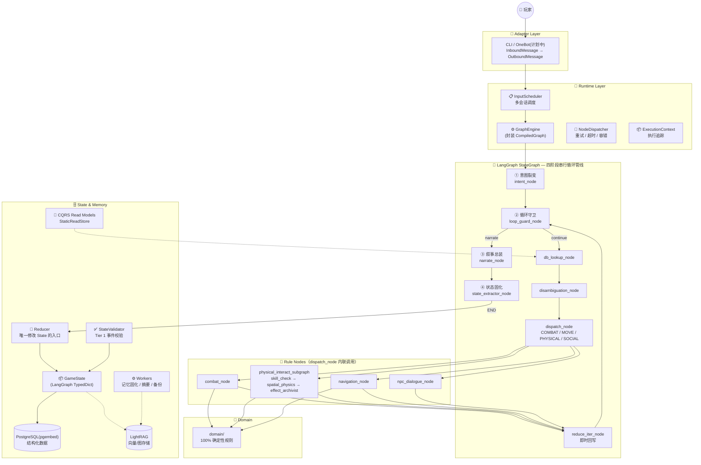
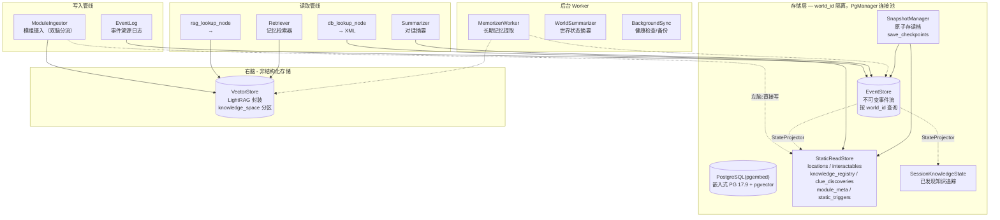

# GlyphKeeper（符语者）

> **Call of Cthulhu (克苏鲁的呼唤)** is a Trademark of Chaosium Inc.
>
> This project is a **Fan Work** created under Chaosium's [Fan Use Policy](https://www.chaosium.com/fan-use-and-licensing/). It is not an official product and is not endorsed by Chaosium Inc.
>
> 本项目遵循 Chaosium 的爱好者使用政策。GlyphKeeper 仅提供**跑团辅助系统的代码逻辑**，不自带任何《克苏鲁的呼唤》规则书原文或官方模组数据。使用者需自行导入合法的规则数据。

### 基于 LangGraph 图编排与事件溯源的 AI COC7版规则跑团守密人系统

## 📖 项目简介

**GlyphKeeper** 是一个为《克苏鲁的呼唤》桌面角色扮演游戏设计的智能守密人（Keeper）系统。它采用 **LangGraph StateGraph 图编排架构**和**双脑式记忆系统**，通过将 AI 守密人的职责拆解为多个专业化 Node，实现了高质量的长程叙事和规则裁决能力。

本项目受 [**Google DeepMind Concordia**](https://github.com/google-deepmind/concordia) 框架与 [**ChatRPG v2**](https://arxiv.org/abs/2210.03620) 论文启发，通过**关注点分离** 原则，将守密人的能力分解为协同工作的多个专业 Node，并基于**事件溯源（Event Sourcing）** 构建单一事实来源。

> **核心理念**：解决 LLM 在长程叙事中的灾难性遗忘与角色悖论问题，创造绝对中立阵营的ai守密人，能遵守COC7版规则与模组大纲，提供原汁原味（？）的COC跑团体验。

---

## 🏗️ 系统架构

GlyphKeeper 采用 **8 层架构**，是一个 **LangGraph StateGraph 驱动**的事件驱动系统。

> **核心范式**：`langgraph stategraph + reducer pattern + deterministic game engine + LLM node system`

### 宏观架构全景图


```mermaid
graph TB
    Player((👤 玩家))

    subgraph "🔌 Adapter Layer"
        Adapter["CLI / OneBot(计划中)<br/>InboundMessage → OutboundMessage"]
    end

    subgraph "🧠 Runtime Layer"
        Engine["⚙️ GraphEngine<br/>(封装 CompiledGraph)"]
        Scheduler["📋 InputScheduler<br/>多会话调度"]
        Dispatcher["🔁 NodeDispatcher<br/>重试 / 超时 / 容错"]
        Ctx["📦 ExecutionContext<br/>执行追踪"]
    end

    subgraph "🔁 LangGraph StateGraph — 四阶段串行循环管线"
        Intent["① 意图裂变<br/>intent_node"]
        LoopGuard["② 循环守卫<br/>loop_guard_node"]
        DB["db_lookup_node"]
        Disambig["disambiguation_node"]
        Dispatch["dispatch_node<br/>COMBAT / MOVE / PHYSICAL / SOCIAL"]
        ReduceIter["reduce_iter_node<br/>即时回写"]
        Narrate["③ 叙事总装<br/>narrate_node"]
        StateExt["④ 状态固化<br/>state_extractor_node"]
    end

    subgraph "🧩 Rule Nodes（dispatch_node 内联调用）"
        CombatN["combat_node"]
        SkillN["physical_interact_subgraph<br/>skill_check → spatial_physics → effect_archivist"]
        NavN["navigation_node"]
        NPCN["npc_dialogue_node"]
    end

    subgraph "🗄️ State & Memory"
        State["📦 GameState<br/>(LangGraph TypedDict)"]
        Reducer["🔄 Reducer<br/>唯一修改 State 的入口"]
        Validator["✅ StateValidator<br/>Tier 1 事件校验"]
        PG[("PostgreSQL(pgembed)<br/>结构化数据")]
        RAG[("LightRAG<br/>向量/图存储")]
        Workers["⚙️ Workers<br/>记忆固化 / 摘要 / 备份"]
        CQRS["📖 CQRS Read Models<br/>StaticReadStore"]
    end

    subgraph "🎲 Domain"
        Domain["domain/<br/>100% 确定性规则"]
    end

    Player --> Adapter
    Adapter --> Scheduler
    Scheduler --> Engine
    Engine --> Intent

    Intent --> LoopGuard

    LoopGuard -->|"continue"| DB
    DB --> Disambig
    Disambig --> Dispatch
    Dispatch --> CombatN
    Dispatch --> SkillN
    Dispatch --> NavN
    Dispatch --> NPCN
    CombatN --> ReduceIter
    SkillN --> ReduceIter
    NavN --> ReduceIter
    NPCN --> ReduceIter
    ReduceIter --> LoopGuard

    LoopGuard -->|"narrate"| Narrate
    Narrate --> StateExt
    StateExt -->|END| Reducer

    Reducer --> State
    Validator --> State
    State --> PG
    State -.-> RAG
    Workers -.-> RAG
    CQRS -.-> DB
    CombatN --> Domain
    SkillN --> Domain
    NavN --> Domain
```

### 八层架构详解

| 层级 | 目录 | 职责 |
|------|------|------|
| **🔌 Adapter 层** | `src/adapter/` | 统一接入层，定义 `InboundMessage`/`OutboundMessage` 协议 |
| **🧠 Runtime 层** | `src/runtime/` | Graph 执行引擎、多会话调度、执行追踪 |
| **🔁 Graph 层** | `src/graph/` | LangGraph StateGraph 拓扑定义，含条件路由与子图 |
| **🧩 Node 层** | `src/nodes/` | 所有可执行能力单元（LLM 节点 / 规则节点 / 工具节点） |
| **🗄️ 数据层** | `src/state/` + `src/memory/` | Event Sourcing + CQRS + 双脑记忆架构 |
| **🎲 域层** | `src/domain/` | 100% 确定性 CoC 规则内核 |
| **🔧 工具层** | `src/tools/` | 外部工具（骰子 / LLM 客户端 / PG 管理 / 配置） |
| **⚙️ Worker 层** | `src/workers/` | 后台记忆固化、世界摘要、健康检查与备份 |

### 执行流程：四阶段串行循环管线

```
玩家输入
    ↓
[Adapter] CLI / OneBot → InboundMessage
    ↓
[Runtime] InputScheduler → GraphEngine
    ↓
[LangGraph] Keeper Graph (StateGraph.ainvoke)
    │
    │  ╔═══ ① 意图裂变 ═══╗
    │  ║ intent_node       ║  ← LLM 将自然语言拆解为多意图队列
    │  ╚═══════════════════╝  ← 单意图时队列长度=1，无 LLM 时规则兜底
    │       ↓
    │  ╔═══ ② 隔离裁决循环 ═══════════════════════════════════╗
    │  ║ loop_guard_node (条件边)                             ║
    │  ║   ├── continue → db_lookup_node                      ║
    │  ║   │     └── 查 PG 读模型 → <physical_reality> XML   ║
    │  ║   │         ↓                                        ║
    │  ║   │     disambiguation_node (三级降级实体消歧)        ║
    │  ║   │         ↓                                        ║
    │  ║   │     dispatch_node (内联意图分发)                  ║
    │  ║   │       ├── COMBAT_ACTION    → combat_node         ║
    │  ║   │       ├── PHYSICAL_INTERACT → physical_interact_subgraph  ║
    │  ║   │       │   └── (skill_check → spatial_physics → effect_archivist)  ║
    │  ║   │       ├── MOVE            → navigation_node      ║
    │  ║   │       └── SOCIAL_INTERACT → npc_dialogue_node    ║
    │  ║   │         ↓                                        ║
    │  ║   │     reduce_iter_node (即时回写 deterministic)     ║
    │  ║   │         ↓                                        ║
    │  ║   │     └──→ 回到 loop_guard_node                    ║
    │  ║   └── narrate → (跳出循环，进入叙事)                   ║
    │  ╚═══════════════════════════════════════════════════════╝
    │       ↓
    │  ╔═══ ③ 叙事总装 ═══╗
    │  ║ narrate_node     ║  ← LLM 消费 executed_actions 链
    │  ╚═══════════════════╝    生成最终叙事文本
    │       ↓
    │  ╔═══ ④ 状态固化 ═══╗
    │  ║ state_extractor  ║  ← 提取 Tier1 事件 + Tier2 事实
    │  ╚═══════════════════╝
    │       ↓
    └──→ END
    ↓
[Engine] EventLog.record_and_apply()
    ├── Reducer.reduce_state(patch → new_state)
    ├── EventStore.append() — 不可变事件流
    └── StateValidator — Tier 1 确定性校验
    ↓
[Workers] 后台固化记忆 (Tier2 → LightRAG)
```

### 执行模式

引擎支持两种模式，默认使用 **langgraph 模式**：

| 模式 | 说明 |
|------|------|
| **langgraph（默认）** | 委托给 `CompiledGraph.ainvoke()`，LangGraph 管理全部流程 |
| **full** | Engine 逐节点手动调度，支持 suspend/resume/retry 控制语义 |

### 关键路由表（dispatch_node 内联分发）

| Intent 类型 | 目标节点 | 说明 |
|---|---|---|
| `COMBAT_ACTION` | `combat_node` | 战斗裁决（调用 domain/combat_rules.py） |
| `PHYSICAL_INTERACT` | `physical_interact_subgraph`<br/>(`skill_check` → `spatial_physics` → `effect_archivist`) | 三阶段物理交互管线：纯数值检定 → 空间仲裁 → 结算与线索颁发 |
| `MOVE` | `navigation_node` | 移动作（确定性验证 + 位置更新） |
| `SOCIAL_INTERACT` | `npc_dialogue_node` | NPC 对话生成 |
| `META` / 未知 | 跳过（空操作） | 仅递增指针，不执行规则 |

> **注意**：旧版 `route_by_intent` 条件边、`CombatSubgraph`、`InvestigationGraph` 已不再被主图使用，由 `dispatch_node` 内联调用对应的规则函数替代。`PHYSICAL_INTERACT` 已升级为三阶段 `physical_interact_subgraph`（`skill_check` → `spatial_physics` → `effect_archivist`），取代了原先的 `skill_node → archivist_node` 双节点链路。

---

## 🗺️ 开发计划

<table>
<tr>
    <th rowspan="22" style="text-align:center; vertical-align:middle; width:48px;">系统框架</th>
    <th style="width:48px; text-align:center;">状态</th>
    <th colspan="2" style="text-align:center;">模块与说明</th>
</tr>
<tr><td style="text-align:center;">✅</td><td colspan="2">CLI适配器，用于简易测试</td></tr>
<tr><td style="text-align:center;">⬜</td><td colspan="2">Onebot 适配器</td></tr>
<tr><td style="text-align:center;">✅</td><td colspan="2">统一执行协议</td></tr>
<tr><td style="text-align:center;">✅</td><td colspan="2">LangGraph引擎，管理图调用与会话生命周期</td></tr>
<tr><td style="text-align:center;">✅</td><td colspan="2">StateGraph 图编排 — 四阶段串行循环管线（loop_guard + dispatch + reduce_iter）</td></tr>
<tr><td style="text-align:center;">✅</td><td colspan="2" style="padding-left:2em;">├ 多意图串行循环（intent_queue + executed_actions 链）</td></tr>
<tr><td style="text-align:center;">✅</td><td colspan="2">GameState&amp;WorldManager世界状态管理</td></tr>
<tr><td style="text-align:center;">⬜</td><td colspan="2">大语言模型云提供方适配</td></tr>
<tr><td style="text-align:center;">✅</td><td colspan="2">CQRS 读模型表与写入管线</td></tr>
<tr><td style="text-align:center;">✅</td><td colspan="2">LightRAG 接入</td></tr>
<tr><td style="text-align:center;">⬜</td><td colspan="2" style="padding-left:2em;">├ 优化是否需要rag的判断</td></tr>
<tr><td style="text-align:center;">✅</td><td colspan="2">双脑记忆系统</td></tr>
<tr><td style="text-align:center;">✅</td><td colspan="2">对象名称消岐系统</td></tr>
<tr><td style="text-align:center;">🔄</td><td colspan="2">状态同步模块（state_extractor_node + Tier1/Tier2 提取管线）</td></tr>
<tr><td style="text-align:center;">✅</td><td colspan="2" style="padding-left:2em;">├ 增加历史消息数</td></tr>
<tr><td style="text-align:center;">✅</td><td colspan="2">Worker 后台任务</td></tr>
<tr><td style="text-align:center;">⬜</td><td colspan="2">多世界并行与管理</td></tr>
<tr><td style="text-align:center;">✅</td><td colspan="2" style="padding-left:2em;">├ known_knowledge未随存档存读而修改</td></tr>
<tr><td style="text-align:center;">✅</td><td colspan="2" style="padding-left:2em;">├ 整体整理乱七八糟的多世界管理与存档</td></tr>
<tr><td style="text-align:center;">✅</td><td colspan="2">条件触发器</td></tr>
<tr><td style="text-align:center;">✅</td><td colspan="2" style="padding-left:2em;">├ 结团检测与流程</td></tr>
<tr><td style="text-align:center;">⬜</td><td colspan="2" style="padding-left:2em;">├ 支持更多条件</td></tr>
<tr>
    <th rowspan="100" style="text-align:center; vertical-align:middle; width:48px; border-top:2px solid #d0d7de;">游戏系统</th>
</tr>
<tr><td style="text-align:center;">✅</td><td colspan="2">模组摄入</td>
<tr><td style="text-align:center;">⬜</td><td colspan="2" style="padding-left:2em;">├ 摄入前检查</td></tr>
<tr><td style="text-align:center;">✅</td><td colspan="2">角色卡与物品背包系统</td>
<tr><td style="text-align:center;">✅</td><td colspan="2" style="padding-left:2em;">├ 物品离包逻辑</td></tr>
<tr><td style="text-align:center;">🔄</td><td colspan="2">调查与线索系统</td></tr>
<tr><td style="text-align:center;">⬜</td><td colspan="2" style="padding-left:2em;">├ 重复检定请求</td></tr>
<tr><td style="text-align:center;">✅</td><td colspan="2" style="padding-left:2em;">├ 无线索时的幻觉问题</td></tr>
<tr><td style="text-align:center;">⬜</td><td colspan="2" style="padding-left:2em;">├ 日记等线索的递进问题</td></tr>
<tr><td style="text-align:center;">⬜</td><td colspan="2" style="padding-left:2em;">├ 多意图框架跳过线索</td></tr>
<tr><td style="text-align:center;">✅</td><td colspan="2">NPC 对话系统</td></tr>
<tr><td style="text-align:center;">⬜</td><td colspan="2" style="padding-left:2em;">├ 场景幻觉问题</td></tr>
<tr><td style="text-align:center;">⬜</td><td colspan="2" style="padding-left:2em;">├ 人设缓存</td></tr>
<tr><td style="text-align:center;">⬜</td><td colspan="2" style="padding-left:2em;">├ 经npc节点的narrator prompt构造</td></tr>
<tr><td style="text-align:center;">⬜</td><td colspan="2" style="padding-left:2em;">├ 随行NPC系统</td></tr>
<tr><td style="text-align:center;">✅</td><td colspan="2">CoC 7版技能检定</td></tr>
<tr><td style="text-align:center;">⬜</td><td colspan="2">战斗轮与体力系统</td></tr>
<tr><td style="text-align:center;">⬜</td><td colspan="2">理智与疯狂</td></tr>
<tr><td style="text-align:center;">✅</td><td colspan="2">场景切换与 location 更新</td></tr>
<tr><td style="text-align:center;">✅</td><td colspan="2" style="padding-left:2em;">├ 场景切换后的新场景描述</td></tr>
<tr><td style="text-align:center;">✅</td><td colspan="2">结团检测</td></tr>
</table>

> To be continue......

---

## 💾 双脑记忆系统

### 架构总览


```mermaid
graph TB
    subgraph "写入管线"
        Ingestion["ModuleIngestor<br/>模组摄入（双脑分流）"]
        EventLog["EventLog<br/>事件溯源日志"]
    end

    subgraph "存储层 — world_id 隔离，PgManager 连接池"
        ES[("EventStore<br/>不可变事件流<br/>按 world_id 查询")]
        PG[("PostgreSQL(pgembed)<br/>嵌入式 PG 17.9 + pgvector")]
        CQRS["StaticReadStore<br/>locations / interactables<br/>knowledge_registry / clue_discoveries<br/>module_meta / static_triggers"]
        SKS["SessionKnowledgeState<br/>已发现知识追踪"]
        Snap["SnapshotManager<br/>原子存读档<br/>save_checkpoints"]
    end

    subgraph "右脑 - 非结构化存储"
        VS[("VectorStore<br/>LightRAG 封装<br/>knowledge_space 分区")]
    end

    subgraph "读取管线"
        Retriever["Retriever<br/>记忆检索器"]
        Summarizer["Summarizer<br/>对话摘要"]
        DBLookup["db_lookup_node<br/>→ <physical_reality> XML"]
        RAGLookup["rag_lookup_node<br/>→ <semantic_knowledge>"]
    end

    subgraph "后台 Worker"
        MW["MemorizerWorker<br/>长期记忆提取"]
        WS["WorldSummarizer<br/>世界状态摘要"]
        BS["BackgroundSync<br/>健康检查/备份"]
    end

    Ingestion -.->|左脑:直接写| CQRS
    Ingestion --> VS
    EventLog --> ES
    ES -.->|StateProjector| CQRS
    ES -.->|StateProjector| SKS
    DBLookup --> CQRS
    RAGLookup --> VS
    Retriever --> VS
    Summarizer --> ES
    MW -.-> ES
    MW -.-> VS
    Snap --> ES
    Snap --> CQRS
```

### 左脑 - 结构化记忆 (PostgreSQL)

基于 **pgembed** 的嵌入式 PostgreSQL 17.9（自动捆绑，无需系统预装），通过 **PgManager 连接池**（`asyncpg.Pool`）统一管理所有组件连接。

**CQRS 读模型表**（`src/state/read_models.py`）：
- **locations**: 场景定义、出口映射、氛围标签（摄入期写入选定，运行时只读）
- **interactables**: 可交互物品（书桌、窗户、门等），关联到所属场景
- **entities**: NPC/实体，关联到所属场景，供消歧系统使用
- **knowledge_registry**: 知识本体注册表，`knowledge_id` 是跨系统的逻辑标识符
- **clue_discoveries**: 多对多线索映射，连接物品/NPC 到知识，定义检定条件和发现叙事
- **module_meta**: 模组注册表（替代旧 `TEMPLATE_SESSION_ID` 方案），存储模组元数据和开场配置
- **static_triggers**: 条件触发器静态注册表

**运行时动态表**：
- **session_knowledge_state**（`src/state/session_state.py`）: 玩家会话中已发现的知识追踪
- **session_trigger_state**（`src/state/read_models.py`）: 触发器运行时状态
- **characters**（`src/state/player_state.py`）: 角色存储，`(scope, key)` 复合主键，`scope='template'` 为种子卡

**EventStore**（`src/memory/event_store.py`）：
- 不可变事件流存储，按 `world_id` 标识事件流（`session_id` 已移除）
- 支持基于 version 的增量查询和状态回放

**SnapshotManager**（`src/state/snapshot.py`）：
- 原子存档/读档，ACID 事务保护
- `snapshots` 表以 `(world_id, snapshot_id)` 复合主键
- `save_checkpoints` 表记录存档时刻的知识/触发器完整状态

### 右脑 - 非结构化记忆 (LightRAG)

负责存储模糊的、联想性的叙事内容：

**技术栈**：
- **LightRAG-HKU**: 图谱增强的 RAG 引擎
- **pgvector**: PostgreSQL 向量扩展，存储文本嵌入
- **NetworkX**: 图数据库，存储实体关系网络

**接口**（`src/memory/`）：
- `event_store.py` — 事件溯源存储（支持 SQLite 降级和 PostgreSQL 两种后端）
- `vector_store.py` — 向量/图语义检索（LightRAG 封装，关闭 gleaning 减少 API 调用）
- `summarizer.py` — 对话摘要与记忆压缩
- `retriever.py` — Graph Node 的统一记忆输入源

### 模组摄入管线（`src/tools/ingestion.py`）

**双脑分流摄入流程**（跳过 EventStore 中间层）：
1. **左脑管线**: 解析 intermediate JSON → 直接写入 StaticReadStore 读模型表（locations/interactables/entities/clue_discoveries/knowledge_registry/static_triggers），同时写入 `module_meta` 表记录模组元数据和开场配置
2. **右脑管线**: 合并全局知识和风味文本 → 去重降噪 → 写入 LightRAG 种子工作区（`__seed__{name}`），供 `/start` 时 PG 级复制
3. **幂等设计**: 同名模组可重复摄入，`ON CONFLICT` 机制确保不产生重复数据

**与旧架构的关键区别**：
- 不再使用 `TEMPLATE_SESSION_ID` 在 EventStore 中存储种子数据
- `StateProjector` 仅在运行时处理事件投影，摄入期不再经过投影管线
- 模组数据以 `world_id=__seed__{name}` 隔离，`/start` 时通过 `copy_static_data_to_world()` PG 级批量复制

---

## 🛠️ 技术栈

### 核心依赖

| 组件 | 技术 | 说明 |
|------|------|------|
| **编程语言** | Python 3.12+ | 利用现代异步特性 |
| **Graph 框架** | LangGraph 0.4+ | StateGraph 驱动的 Agent 编排引擎 |
| **LLM 集成** | OpenAI-compatible API (aiohttp) | 直接调用，不依赖第三方 SDK |
| **数据库** | PostgreSQL 17.9 (pgembed 嵌入式) + pgvector | 自动捆绑，无需系统预装 |
| **连接池** | PgManager (asyncpg.Pool) | 统一连接管理，消除各自独立连接 |
| **CQRS 读模型** | asyncpg + 自定义表结构 | locations / interactables / module_meta / clue_discoveries |
| **快照系统** | 原子 ACID 事务 | snapshots + save_checkpoints 双表保障存档一致性 |
| **RAG 引擎** | LightRAG-HKU | 图谱增强的高级 RAG |
| **配置管理** | PyYAML + Pydantic | 类型安全的配置系统 |
| **日志系统** | Python logging + RotatingFileHandler | 结构化日志，支持分级日志 |
| **包管理** | uv | 快速的现代 Python 包管理器 |

### LLM 分级调用策略

为了平衡性能和成本，系统支持**三级模型配置**：

| 等级 | 用途 | 示例场景 |
|------|------|----------|
| **fast** | 快速响应、简单任务 | 意图识别、是/否判断 |
| **standard** | 常规叙事 | 场景描述、NPC 对话 |
| **smart** | 复杂推理 | 关键剧情决策、规则裁决 |

配置文件位置：[config.yaml](config.yaml)

---

## 📁 项目结构

```
GlyphKeeper/
├── config.yaml              # 主配置文件
├── providers.ini            # LLM 提供商配置
├── pyproject.toml           # 项目依赖管理
├── run_cli.py               # CLI 启动入口
│
├── data/                    # 数据目录
│   ├── worlds/              # 世界/模组存档
│   ├── modules/             # 原始模组文件
│   ├── rules/               # 规则书数据
│   ├── raw_sources/         # 原始来源文件
│   ├── intermediate/        # 摄入中间文件（book.json 等）
│   ├── backups/             # 自动备份
│   └── pg_data/             # pgembed 嵌入式 PostgreSQL 数据
│
├── logs/                    # 日志目录
│   ├── *.log                # 运行时日志（按日期轮转）
│
├── scripts/                 # 乱七八糟的工具脚本
│   ├── init_db.py           # 数据库初始化
│   ├── manage_worlds.py     # 世界管理
│   ├── ingest_module.py     # 模组摄入
│   ├── ingest_rules.py      # 规则摄入
│   ├── ingest_investigator.py # 调查员摄入
│   ├── inspect_graph.py     # 检查 RAG 图谱
│   ├── check_schema.py      # 模组 JSON schema 校验
│   ├── verify_db.py         # 数据库完整性验证
│   ├── verify_ingestion.py  # 摄入结果验证
│   ├── verify_read_models.py # 读模型验证
│   ├── reset_all_data.py    # 重置所有数据
│   ├── smoke_test.py        # 冒烟测试
│   └── run_all_tests.py     # 全量测试运行器
│
├── src/                     # 源代码
│   ├── _protocols.py        # 🔷 统一执行协议（历史参考）
│   │                        #    NodeInput/NodeOutput 为早期设计，
│   │                        #    当前节点统一用 state: GameState -> dict 签名
│   │
│   ├── adapter/             # 🔌 统一接入层
│   │   ├── protocol.py      # InboundMessage / OutboundMessage 协议
│   │   ├── base.py          # AbstractAdapter 基类
│   │   ├── cli.py           # CLI REPL 适配器（含角色创建向导）
│   │   └── onebot.py        # OneBot 11 协议（TODO）
│   │
│   ├── runtime/             # 🧠 执行引擎
│   │   ├── engine.py        # GraphEngine — 封装 LangGraph CompiledGraph
│   │   ├── scheduler.py     # InputScheduler — 多会话调度
│   │   ├── dispatcher.py    # NodeDispatcher — 节点分发与重试
│   │   └── context.py       # ExecutionContext — 执行追踪
│   │
│   ├── state/               # 🗄️ 世界唯一真相（Event Sourcing + CQRS）
│   │   ├── game_state.py    # GameState TypedDict + 视图裁剪
│   │   ├── reducer.py       # State Reducer — 唯一修改 State 的入口
│   │   ├── event_log.py     # EventLog — 事件溯源编排层
│   │   ├── snapshot.py      # 状态快照管理
│   │   ├── world_state.py   # WorldManager — 场景/NPC/物品状态
│   │   ├── player_state.py  # CharacterStore — 角色持久化（PG/JSON 降级）
│   │   ├── module_loader.py # ModuleLoader — 模组载入
│   │   ├── read_models.py   # StaticReadStore — CQRS 读模型表
│   │   ├── projector.py     # StateProjector — 事件→读模型投影
│   │   ├── session_state.py # SessionKnowledgeState — 知识发现追踪
│   │   └── state_validator.py # StateValidator — Tier 1 事件确定性校验
│   │
│   ├── graph/               # 🔁 LangGraph StateGraph 定义
│   │   ├── keeper_graph.py       # 守密人主 Graph — 四阶段串行循环管线
│   │   ├── combat_graph.py       # 战斗子 Graph（遗留，已由 dispatch_node 内联代替）
│   │   ├── investigation_graph.py # 调查子 Graph（遗留，已由 dispatch_node 内联代替）
│   │   └── router_graph.py       # route_by_intent 条件边函数（遗留，已由 dispatch_node 代替）
│   │
│   ├── nodes/               # 🧩 执行节点
│   │   ├── llm/             # 🤖 LLM 驱动节点
│   │   │   ├── intent_node.py       # 意图分析（LLM + 规则兜底，输出多意图队列）
│   │   │   ├── narrator_node.py     # 叙事生成（LLM + 模板兜底，消费 executed_actions）
│   │   │   ├── adjudicator_node.py  # 即兴裁决（LLM + 规则兜底）
│   │   │   └── npc_dialogue_node.py # NPC 对话生成
│   │   ├── rules/           # 📐 确定性规则节点
│   │   │   ├── combat_node.py       # 战斗行动裁决
│   │   │   ├── sanity_node.py       # 理智检定与疯狂判定
│   │   │   └── skill_node.py        # 技能检定
│   │   └── tools/           # 🔧 工具节点
│   │       ├── loop_guard_node.py   # 循环守卫 — 检查意图队列指针
│   │       ├── dispatch_node.py     # 意图分发 — COMBAT/MOVE/PHYSICAL/SOCIAL 内联路由
│   │       ├── reduce_iter_node.py  # 循环内即时 Reducer — 回写 deterministic_changes
│   │       ├── archivist_node.py    # 线索查询（目标解析 + PG 查线索）
│   │       ├── dice_node.py         # 掷骰执行
│   │       ├── db_lookup_node.py    # PG 读模型查询 → <physical_reality>
│   │       ├── rag_lookup_node.py   # LightRAG 检索 → <semantic_knowledge>
│   │       ├── roll_node.py         # 自动化检定
│   │       ├── disambiguation_node.py # 实体消歧
│   │       └── state_extractor_node.py # 状态同步（Tier1/Tier2 提取）
│   │
│   ├── tools/               # 🔧 外部工具层
│   │   ├── config.py        # 配置管理（config.yaml + providers.ini）
│   │   ├── llm_client.py    # 统一 LLM 调用客户端（aiohttp）
│   │   ├── pg_manager.py    # PgManager — 嵌入式 PG 连接管理
│   │   ├── ingestion.py     # ModuleIngestor — 双脑分流摄入管线
│   │   ├── archivist.py     # Archivist — 线索发现管理员
│   │   ├── dice.py          # 掷骰引擎
│   │   ├── random.py        # 安全随机工具
│   │   ├── vector_search.py # 向量搜索封装
│   │   ├── time.py          # 游戏时间工具
│   │   └── utils.py         # 通用工具函数
│   │
│   ├── domain/              # 🎲 CoC 规则域模型（100% 确定性）
│   │   ├── character.py     # 角色模型（属性/技能/职业模板）
│   │   ├── coc_rules.py     # 核心规则（成功等级/难度）
│   │   ├── sanity_rules.py  # 理智规则（SAN 损失/疯狂）
│   │   ├── combat_rules.py  # 战斗规则（伤害/护甲/武器）
│   │   ├── checks.py        # 检定逻辑
│   │   └── navigation.py    # 导航验证
│   │
│   ├── memory/              # 🧠 长期记忆系统
│   │   ├── event_store.py   # 事件溯源存储（PG/SQLite）
│   │   ├── vector_store.py  # 向量/图语义检索（LightRAG）
│   │   ├── summarizer.py    # 对话摘要与记忆压缩
│   │   └── retriever.py     # Graph Node 的记忆输入源
│   │
│   ├── workers/             # ⚙️ 后台任务
│   │   ├── memorizer_worker.py   # 长期记忆提取与固化
│   │   ├── world_summarizer.py   # 世界状态压缩与摘要
│   │   └── background_sync.py    # 健康检查/备份/清理
│   │
│   └── tests/               # 测试套件
│       ├── test_domain.py
│       ├── test_graph.py
│       ├── test_memory.py
│       ├── test_nodes.py
│       ├── test_runtime.py
│       ├── test_state.py
│       ├── test_tools.py
│       └── test_hello_graph.py
│
├── tests/                   # 集成测试与演示
│   ├── test_integration.py
│   ├── demo_narrator.py
│   └── ...
│
├── docs/                    # 设计文档
│   ├── 开发路线0.md          # Phase 0-7 路线图（已完成）
│   ├── 开发路线1.md          # Phase 8-16 路线图（已完成）
│   └── ...
│
├── backup_old_structure/    # 旧代码备份
│   └── old_src/
│
└── template/                # 配置文件模板
    ├── config.yaml.template
    └── providers.ini.template
```

---

## 💡 工作流示例

### 场景 1：动态线索发现

**背景**：玩家搜索书桌，但关键道具"日记"原本放置在床下。系统通过 `Archivist` 工具函数动态调整。

```
玩家输入: "我仔细翻找书桌的抽屉。"

[Graph 执行流程 — 四阶段串行循环管线]

① 意图裂变
1. intent_node (LLM)
   → 意图队列: [{type: PHYSICAL_INTERACT, data: {target: "书桌", skill_name: "侦查"}}]
   → 队列长度=1 (单意图)
       ↓

② 隔离裁决循环（仅 1 次迭代）
2. loop_guard_node → current_intent_idx(0) < len(queue)(1) → continue
3. db_lookup_node (SQL)
   → 查 locations 表获取当前场景
   → 查 interactables 表获取场景物品（书桌、床等）
   → 拼 <physical_reality> XML
4. disambiguation_node (三级降级匹配)
   → "书桌" → 匹配到 interactables.书桌 → resolved_targets
5. dispatch_node → PHYSICAL_INTERACT → physical_interact_subgraph
   ├─ skill_check_node: 侦查检定 → 成功
   ├─ spatial_physics_node: 书桌在当前场景 → 可达
   └─ effect_archivist_node: 解析目标 key + 查 clue_discoveries
      → 发现"书桌→日记"的线索关联
   → 输出 ActionExecutionResult 追加到 executed_actions
6. reduce_iter_node → 将 deterministic_changes 即时回写 State
7. loop_guard_node → current_intent_idx(1) >= len(queue)(1) → narrate
       ↓

③ 叙事总装
8. narrate_node (LLM)
   → 消费 executed_actions[0] 中的 rule_context + raw_fixed_text + flavor_context
   → 叙事输出: "你拉开书桌的第三个抽屉，在一堆陈旧的账本后面，
     发现了一本皮质封面的日记。泛黄的纸页散发出霉味。"
       ↓

④ 状态固化
9. state_extractor_node (fast LLM)
   → 提取 Tier 1 事件: 无（纯叙事，无规则变更）
   → 提取 Tier 2 事实: "书桌抽屉里有一本皮质封面日记"
   → pending_tier1_events / pending_tier2_facts 输出
```

### 场景 2：规则裁决

**背景**：玩家在战斗中选择攻击方式，系统通过确定性规则节点进行计算。

```
玩家输入: "我要用斗殴攻击邪教徒！"

[Graph 执行流程]

① 意图裂变
1. intent_node (fast LLM)
   → 意图队列: [{type: COMBAT_ACTION, data: {action: "attack", skill_name: "斗殴"}}]
       ↓

② 隔离裁决循环
2. loop_guard → continue
3. db_lookup_node (SQL) → 查当前场景
4. disambiguation_node → "邪教徒" → 匹配 entities → resolved_targets
5. dispatch_node → COMBAT_ACTION → combat_node
   → domain/combat_rules.py (100% 确定性)
   → 计算命中/闪避/伤害
   → 输出 ActionExecutionResult
6. reduce_iter_node → 回写 HP 等变更
7. loop_guard → narrate
       ↓

③ 叙事总装
8. narrate_node (standard LLM)
   → 叙事输出: "你握紧拳头，猛地向邪教徒挥去..."
       ↓

④ 状态固化
9. state_extractor_node
   → 提取 Tier 1: combat 相关状态变更
```

### 场景 3：多意图混合输入（串行循环核心优势）

**背景**：玩家在一句话中表达了多个动作，旧架构只能处理第一个，新架构串行处理全部。

```
玩家输入: "我先安抚一下受惊的图书馆员，然后去翻阅桌上的古籍。"

[Graph 执行流程]

① 意图裂变
1. intent_node (LLM)
   → 意图队列: [
       {type: SOCIAL_INTERACT, data: {target: "图书馆员", ...}},
       {type: PHYSICAL_INTERACT, data: {target: "古籍", skill_name: "图书馆使用", ...}},
     ]
   → 队列长度=2（双意图）
       ↓

② 隔离裁决循环 — 第 1 轮 (idx=0)
2. loop_guard → 0 < 2 → continue
3. db_lookup_node → 查当前场景
4. disambiguation_node → "图书馆员" → 匹配 entities
5. dispatch_node → SOCIAL_INTERACT → npc_dialogue_node
   → NPC 对话生成
   → 追加 ActionExecutionResult 到 executed_actions
6. reduce_iter_node → 回写对话状态
       ↓

② 隔离裁决循环 — 第 2 轮 (idx=1)
7. loop_guard → 1 < 2 → continue
8. db_lookup_node → 查当前场景（可能已因 NPC 对话而变化）
9. disambiguation_node → "古籍" → 匹配 interactables
10. dispatch_node → PHYSICAL_INTERACT → physical_interact_subgraph
    ├─ skill_check_node: 图书馆使用检定
    ├─ spatial_physics_node: 古籍可达性校验
    └─ effect_archivist_node: 查线索 → 追加 ActionExecutionResult
11. reduce_iter_node → 回写变更
        ↓

12. loop_guard → 2 >= 2 → narrate
        ↓

③ 叙事总装
13. narrate_node (LLM)
    → 消费 executed_actions 全部两条记录
    → 叙事输出: "你温和地向图书馆员点点头，示意她不必惊慌...
       然后转身走向书桌，翻开那本泛黄的古籍..."
        ↓

④ 状态固化
14. state_extractor_node
    → 提取 Tier1 + Tier2
```

---

## 📝 配置说明

### config.yaml 核心配置项

```yaml
project:
  name: GlyphKeeper
  debug: true                          # 调试模式
  active_world: test                   # 当前激活的世界
  model_cost_tracking: false           # 是否开启模型成本追踪

model_tiers:
  fast:                                # 快速响应（意图分析）
    provider: SILKFLOW
    model_name: deepseek-ai/DeepSeek-V3
    temperature: 0.3
    max_tokens: 512
    input_cost: 2
    output_cost: 3
  standard:                            # 标准（规则解释）
    provider: SILKFLOW
    model_name: deepseek-ai/DeepSeek-V3.2
    temperature: 0.7
    max_tokens: 2048
    input_cost: 2
    output_cost: 3
  smart:                               # 智能（叙事生成）
    provider: SILKFLOW
    model_name: deepseek-ai/DeepSeek-V4-Flash
    temperature: 0.8
    max_tokens: 4096
    input_cost: 2
    output_cost: 3

vector_store:
  provider: LOCAL
  embedding_model_name: Alibaba-NLP/gte-modernbert-base
  chunk_size: 500
  chunk_overlap: 50
  embedding_dim: 768
  input_cost: 0
  output_cost: 0

lightrag:
  default_query_mode: hybrid           # local / global / hybrid / naive
  default_top_k: 60

langsmith:
  tracing_enabled: true
  project: glyphkeeper
  endpoint: https://api.smith.langchain.com
```

---

### 开发环境设置

```bash
# Fork 并克隆仓库
git clone https://github.com/your-username/GlyphKeeper.git
cd GlyphKeeper

# 创建开发分支
git checkout -b feature/your-feature-name

# 安装开发依赖
uv sync --dev

# 运行单元测试（源码内测试）
uv run pytest src/tests/ -v

# 运行集成测试
uv run pytest tests/ -v
```

---

## ⚠️ 免责声明

1. **版权声明**：
   - 本项目是基于 Chaosium Inc. 的粉丝使用政策创建的爱好者作品
   - 不包含任何受版权保护的官方内容（规则书原文、模组文本等）
   - 用户需自行获取合法的规则书和模组资料

2. **使用限制**：
   - 本软件仅供个人学习和非商业用途
   - 请勿用于任何商业活动或盈利目的
   - 遵守当地法律法规

3. **免责条款**：
   - 软件按原样提供，不提供任何明示或暗示的保证
   - 作者不对使用本软件造成的任何损失负责
   - 用户需自行承担使用风险

---

## 📄 许可证

本项目采用 [Apache 2.0 License](LICENSE)。

---

## 🙏 致谢

- [Chaosium Inc.](https://www.chaosium.com/) - 创造了精彩的 Call of Cthulhu 游戏
- [LightRAG-HKU](https://github.com/HKUDS/LightRAG) - 强大的图谱增强 RAG 引擎
- [Google DeepMind Concordia](https://github.com/google-deepmind/concordia) - 多智能体架构灵感来源
- [ChatRPG v2](https://arxiv.org/abs/2210.03620) - 理论基础参考
- [Google Gemini](https://gemini.google.com/) - 提供代码编写协助与结对编程支持

---

**⭐ 如果本项目对你有帮助，欢迎 Star 支持！**
