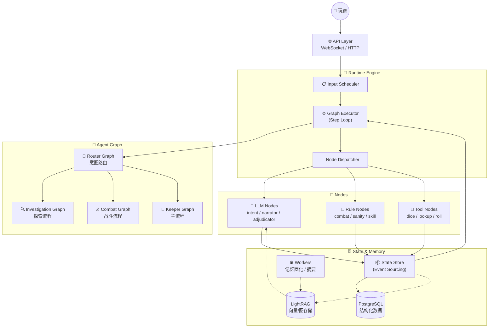
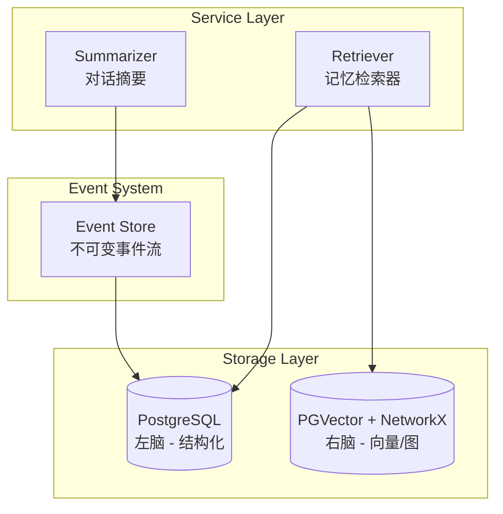

# GlyphKeeper（符语者）

> **Call of Cthulhu (克苏鲁的呼唤)** is a Trademark of Chaosium Inc.
>
> This project is a **Fan Work** created under Chaosium's [Fan Use Policy](https://www.chaosium.com/fan-use-and-licensing/). It is not an official product and is not endorsed by Chaosium Inc.
>
> 本项目遵循 Chaosium 的爱好者使用政策。GlyphKeeper 仅提供**跑团辅助系统的代码逻辑**，不自带任何《克苏鲁的呼唤》规则书原文或官方模组数据。使用者需自行导入合法的规则数据。

### 基于图编排与事件溯源的 AI COC7版规则跑团守密人系统

> **核心理念**：通过 Graph Runtime 图编排与双脑式记忆架构，解决 LLM 在长程叙事中的灾难性遗忘与角色悖论问题

## 📖 项目简介

**GlyphKeeper** 是一个为《克苏鲁的呼唤》桌面角色扮演游戏设计的智能守密人（Keeper）系统。它采用**Graph Runtime 图编排架构**和**双脑式记忆系统**，通过将 AI 守密人的职责拆解为多个专业化节点，实现了高质量的长程叙事和规则裁决能力。

传统的"单体 LLM + 提示词工程"方案存在根本性矛盾：同一个模型既要发挥创造性进行叙事，又要严格维护游戏状态和规则，这导致了记忆混乱和逻辑冲突。本项目受 **Google DeepMind Concordia** 框架与 **ChatRPG v2** 论文启发，通过**关注点分离** 原则，将守密人的能力分解为协同工作的多个专业代理，并基于**持久化数据库**构建单一事实来源。

## 🎯 核心痛点与解决方案

| 痛点 | 传统 LLM 方案的问题 | GlyphKeeper 解决方案 |
| --- | --- | --- |
| **记忆遗忘** | 依赖有限的 Context Window，随对话变长必然遗忘 | **双脑式记忆架构**：结构化数据存储在 PostgreSQL，非结构化叙事存储在基于 LightRAG 的向量/图数据库 |
| **角色冲突** | 单个模型既要"创造性叙事"又要"严格维护状态" | **Graph Node 分工**：LLM Nodes 负责创作，Rule Nodes 负责裁决，Event → Reducer 维护状态 |
| **逻辑不一致** | LLM 凭空编造或记忆错乱（如：搜索过的房间重复刷新物品） | **单一事实来源**：所有游戏状态持久化到数据库，LLM 只作为"执行器"而非"存储器" |
| **规则混淆** | LLM 虚构或混淆 CoC 规则（如：错误的孤注一掷判定） | **确定性规则内核**：`domain/` 层 100% 无 LLM 逻辑 + RAG 规则检索辅助 |

---

## 🏗️ 系统架构

GlyphKeeper 采用 **3 层 + 1 Runtime 架构**，是一个 **Graph Runtime 驱动**的事件驱动系统。

> **核心范式**：`event-driven graph runtime + deterministic game engine + LLM node system`

### 宏观架构全景图


```mermaid
graph TB
    Player((👤 玩家))
    WS["🌐 API Layer<br/>WebSocket / HTTP"]

    subgraph "🧠 Runtime Engine"
        Engine["⚙️ Graph Executor<br/>(Step Loop)"]
        Scheduler["📋 Input Scheduler"]
        Dispatcher["🔀 Node Dispatcher"]
    end

    subgraph "🔁 Agent Graph"
        Router["🔄 Router Graph<br/>意图路由"]
        Combat["⚔️ Combat Graph<br/>战斗流程"]
        Investigate["🔍 Investigation Graph<br/>探索流程"]
        Keeper["👤 Keeper Graph<br/>主流程"]
    end

    subgraph "🧩 Nodes"
        LLMN["🤖 LLM Nodes<br/>intent / narrator / adjudicator"]
        RuleN["📐 Rule Nodes<br/>combat / sanity / skill"]
        ToolN["🔧 Tool Nodes<br/>dice / lookup / roll"]
    end

    subgraph "🗄️ State & Memory"
        State["📦 State Store<br/>(Event Sourcing)"]
        PG[("PostgreSQL<br/>结构化数据")]
        RAG[("LightRAG<br/>向量/图存储")]
        Workers["⚙️ Workers<br/>记忆固化 / 摘要"]
    end

    Player --> WS
    WS --> Scheduler
    Scheduler --> Engine
    Engine --> Router
    Router --> Investigate
    Router --> Combat
    Router --> Keeper

    Engine --> Dispatcher
    Dispatcher --> LLMN
    Dispatcher --> RuleN
    Dispatcher --> ToolN

    LLMN --> State
    RuleN --> State
    ToolN --> State

    State --> PG
    State -.-> RAG
    RAG -.-> LLMN
    Workers -.-> RAG
    State --> Engine
```

### 三层详解

| 层级 | 目录 | 职责 |
|------|------|------|
| **🧠 Runtime 层** | `src/runtime/` | Graph 执行引擎、输入调度、Node 路由分发、执行上下文管理 |
| **🔁 Graph 层** | `src/graph/` | 系统行为拓扑定义，描述"意图→路由→裁决→叙事"的完整流程 |
| **🧩 Node 层** | `src/nodes/` | 所有可执行能力单元（LLM 节点 / 规则节点 / 工具节点） |
| **🗄️ 数据层** | `src/state/` + `src/memory/` | 事件溯源状态 + 双脑记忆架构 |

### 核心流水线：Graph Step Loop

```
玩家输入
    ↓
[API Layer] WebSocket / HTTP
    ↓
[Runtime Engine] Graph Executor 启动 Step Loop
    ↓
[Graph] Router → 意图路由
    ├──→ Investigation Graph: 搜索 → 线索 → 知识授予
    ├──→ Combat Graph: 先攻 → 行动 → 伤害 → 结算
    └──→ Keeper Graph: 主流程叙事
    ↓
[State] Event → Reducer → 状态变更（不可变事件流）
    ↓
[Memory / RAG] 后台 Worker 自动固化
```

---

## 💾 双脑记忆系统

### 架构总览


```mermaid
graph TB
    subgraph "Service Layer"
        Retriever["Retriever<br/>记忆检索器"]
        Summarizer["Summarizer<br/>对话摘要"]
    end

    subgraph "Storage Layer"
        PG[("PostgreSQL<br/>左脑 - 结构化")]
        VEC[("PGVector + NetworkX<br/>右脑 - 向量/图")]
    end

    subgraph "Event System"
        ES["Event Store<br/>不可变事件流"]
    end

    Retriever --> PG
    Retriever --> VEC
    Summarizer --> ES
    ES --> PG
```

### 左脑 - 结构化记忆 (PostgreSQL)

负责存储精确的、逻辑严密的游戏数据：

**核心数据模型**（旧版参考：`backup_old_structure/old_src/memory/models.py`）：
- **Location**: 地点及其连接关系
- **Entity**: 玩家、NPC、怪物（包含属性、状态、战斗数据）
- **Interactable**: 物理容器（箱子、门、尸体等）
- **ClueDiscovery**: 线索发现的中间层（支持多对多映射）
- **Knowledge**: 逻辑开关，指向 LightRAG 中的具体知识内容
- **GameSession**: 全局游戏状态（时间、节拍、存档点）

### 右脑 - 非结构化记忆 (LightRAG)

负责存储模糊的、联想性的叙事内容：

**技术栈**：
- **LightRAG-HKU**: 图谱增强的 RAG 引擎
- **pgvector**: PostgreSQL 向量扩展，存储文本嵌入
- **NetworkX**: 图数据库，存储实体关系网络

**新接口**（`src/memory/`）：
- `event_store.py` — 事件溯源存储（不可变事件流）
- `vector_store.py` — 向量/图语义检索（LightRAG 封装）
- `summarizer.py` — 对话摘要与记忆压缩
- `retriever.py` — Graph Node 的统一记忆输入源

---

## 🛠️ 技术栈

### 核心依赖

| 组件 | 技术 | 说明 |
|------|------|------|
| **编程语言** | Python 3.12+ | 利用现代异步特性 |
| **Graph Runtime** | LangGraph | 状态图驱动的 Agent 执行引擎 |
| **LLM 集成** | OpenAI-compatible API | 支持 OpenAI / Azure OpenAI / 兼容接口 |
| **数据库** | PostgreSQL + pgvector | 关系型数据 + 向量检索 |
| **ORM** | SQLAlchemy 2.0 | 异步 ORM |
| **RAG 引擎** | LightRAG-HKU | 图谱增强的高级 RAG |
| **配置管理** | PyYAML + Pydantic | 类型安全的配置系统 |
| **日志系统** | Python logging | 结构化日志记录 |
| **包管理** | uv | 快速的现代 Python 包管理器 |

### LLM 分级调用策略

为了平衡性能和成本，系统支持**三级模型配置**：

| 等级 | 用途 | 示例场景 |
|------|------|----------|
| **fast** | 快速响应、简单任务 | 意图识别、是/否判断 |
| **standard** | 常规叙事 | 场景描述、NPC 对话 |
| **smart** | 复杂推理 | 关键剧情决策、规则裁决 |

配置文件位置：[config.yaml](config.yaml)

---

## 🚀 快速开始

### 1. 环境准备

**系统要求**：
- Python 3.12 或更高版本
- PostgreSQL 16+ (需安装 pgvector 扩展)
- 4GB+ 可用内存

**安装步骤**：

```bash
# 1. 克隆项目
git clone https://github.com/yourusername/GlyphKeeper.git
cd GlyphKeeper

# 2. 安装 uv（推荐的包管理器）
pip install uv

# 3. 安装项目依赖
uv sync

# 4. 配置文件
cp template/config.yaml.template config.yaml
cp template/providers.ini.template providers.ini
```

### 2. 配置系统

**编辑 `config.yaml`**：

```yaml
project:
  name: "GlyphKeeper"
  active_world: "my_game"        # 当前激活的世界/模组
  model_usage_logging: true      # 启用 Token 使用统计

database:
  host: "localhost"
  port: "5432"
  username: "your_db_user"
  password: "your_db_password"
  project_name: "GlyphKeeper"

model_tiers:
  fast: "gpt-4o-mini"
  standard: "gpt-4o"
  smart: "gpt-4o"
```

**编辑 `providers.ini`** 填入 LLM API 密钥：

```ini
[openai]
base_url = https://api.openai.com/v1
api_key = sk-your-api-key-here
```

### 3. 初始化数据库

```bash
# 初始化数据库表结构
uv run python scripts/init_db.py

# (可选) 查看可用的世界管理命令
uv run python scripts/manage_worlds.py --help
```

### 4. 导入模组数据

```bash
# 导入 PDF 格式的模组文件
uv run python scripts/ingest_module.py path/to/your_module.pdf

# 或使用交互式导入（旧版入口，位于备份目录）
uv run python backup_old_structure/old_src/interfaces/cli_runner.py
```

### 5. 运行系统

**方式 A：命令行交互模式**
```bash
# （CLI 待实现 — 暂用旧版入口）
uv run python backup_old_structure/old_src/interfaces/cli_runner.py
```

**方式 B：启动 API 服务**
```bash
# （API 服务待实现 — 暂用旧版入口）
uv run python backup_old_structure/old_src/interfaces/api_server.py
```

---

## 📁 项目结构

```
GlyphKeeper/
├── config.yaml              # 主配置文件
├── providers.ini            # LLM 提供商配置
├── pyproject.toml           # 项目依赖管理
│
├── data/                    # 数据目录
│   ├── worlds/              # 世界/模组存档（每个世界独立子目录）
│   ├── modules/             # 原始模组文件
│   ├── rules/               # 规则书数据
│   └── tmp/                 # 临时文件
│
├── logs/                    # 日志目录
│   └── llm_usage.jsonl      # LLM Token 使用统计
│
├── scripts/                 # 工具脚本
│   ├── init_db.py           # 初始化数据库
│   ├── manage_worlds.py     # 世界管理（创建/切换/删除）
│   ├── ingest_module.py     # 导入模组
│   └── inspect_graph.py     # 检查 RAG 图谱
│
├── src/                     # 源代码（新 Graph Runtime 架构）
│   ├── runtime/             # 🧠 Graph 执行引擎（系统 CPU）
│   │   ├── engine.py        # Graph 执行器 — 核心 Step Loop
│   │   ├── scheduler.py     # 多玩家输入调度器
│   │   ├── dispatcher.py    # Node 路由分发器
│   │   └── context.py       # 执行上下文管理
│   │
│   ├── state/               # 🗄️ 世界唯一真相（Event Sourcing）
│   │   ├── game_state.py    # 游戏全局状态
│   │   ├── player_state.py  # 玩家/调查员状态
│   │   ├── world_state.py   # 世界状态管理器
│   │   ├── event_log.py     # 事件溯源日志
│   │   └── snapshot.py      # 状态快照管理
│   │
│   ├── graph/               # 🔁 Agent Graph 定义（节点+边拓扑）
│   │   ├── keeper_graph.py       # 守密人主 Graph
│   │   ├── combat_graph.py       # 战斗子 Graph
│   │   ├── investigation_graph.py # 调查/探索子 Graph
│   │   └── router_graph.py       # 意图路由子 Graph
│   │
│   ├── nodes/               # 🧩 所有可执行能力节点
│   │   ├── llm/             # 🤖 LLM 节点
│   │   │   ├── intent_node.py      # 意图分析
│   │   │   ├── narrator_node.py    # 叙事生成
│   │   │   └── adjudicator_node.py # 即兴裁决
│   │   ├── rules/           # 📐 确定性规则节点
│   │   │   ├── combat_node.py     # 战斗规则
│   │   │   ├── sanity_node.py     # 理智规则
│   │   │   └── skill_node.py      # 技能检定
│   │   └── tools/           # 🔧 工具节点
│   │       ├── dice_node.py       # 掷骰执行
│   │       ├── lookup_node.py     # 知识检索
│   │       └── roll_node.py       # 自动化检定
│   │
│   ├── tools/               # 🔧 外部工具（纯函数，无副作用）
│   │   ├── dice.py          # 掷骰引擎（D100/Bonus/Penalty）
│   │   ├── random.py        # 安全随机工具
│   │   ├── vector_search.py # 向量搜索封装
│   │   ├── time.py          # 游戏时间工具
│   │   └── utils.py         # 通用工具函数
│   │
│   ├── domain/              # 🎲 CoC 规则域模型（100% 确定性）
│   │   ├── coc_rules.py     # 核心规则（成功等级/难度）
│   │   ├── sanity_rules.py  # 理智规则（SAN 损失/疯狂）
│   │   ├── combat_rules.py  # 战斗规则（伤害/护甲/武器）
│   │   ├── character.py     # 角色模型（属性/技能/职业）
│   │   └── checks.py        # 检定逻辑（技能/属性/对抗）
│   │
│   ├── memory/              # 🧠 长期记忆系统
│   │   ├── event_store.py   # 事件溯源存储
│   │   ├── vector_store.py  # 向量/图语义检索（LightRAG）
│   │   ├── summarizer.py    # 对话摘要与记忆压缩
│   │   └── retriever.py     # Graph Node 的输入源
│   │
│   ├── workers/             # ⚙️ 后台任务
│   │   ├── memorizer_worker.py   # 长期记忆提取
│   │   ├── world_summarizer.py   # 世界状态摘要
│   │   └── background_sync.py    # 后台数据同步
│   │
│   ├── api/                 # 🌐 接口层
│   │   ├── websocket.py     # WebSocket 实时通信
│   │   ├── routes.py        # RESTful HTTP 路由
│   │   └── dto.py           # 数据传输对象
│   │
│   ├── config/              # 配置管理
│   │   └── __init__.py
│   │
│   └── tests/               # 测试套件
│       ├── test_domain.py   # 域模型单元测试
│       ├── test_tools.py    # 工具层单元测试
│       └── test_runtime.py  # Runtime 集成测试
│
├── backup_old_structure/    # 旧代码备份参考
│   └── old_src/             # 原 agents/resolver/core/... 完整存档
│
├── tests/                   # 旧版测试与演示
└── template/                # 配置文件模板
    ├── config.yaml.template
    └── providers.ini.template
```

---

## 💡 工作流示例

### 场景 1：动态线索发现

**背景**：玩家搜索书桌，但关键道具"日记"原本放置在床下。系统动态调整剧情，奖励玩家的合理探索。

```
玩家输入: "我仔细翻找书桌的抽屉。"

[Narrator 内部推理]
Think: 玩家在搜索书桌，需要查询：
      1. 书桌的状态（是否被搜索过）
      2. 日记的位置（预设在床垫下）

Action: 调用 Archivist.get_location_view("玩家")
        调用 Archivist.inspect_target("玩家", "书桌")

Observation: {
  "desk": {"searched": false},
  "diary": {"location": "bed_mattress", "discovered": false}
}

Think: 书桌尚未搜索过，玩家的行为合理。
       为了流畅性，可以将日记移到这里。

Action: 调用 Archivist.discover_clue("玩家", "书桌", "diary")

Narrator 输出: 
"你拉开书桌的第三个抽屉，在一堆陈旧的账本后面，
发现了一本皮质封面的日记。泛黄的纸页散发出霉味。"
```

### 场景 2：规则裁决

**背景**：玩家在技能检定失败后请求"孤注一掷"，Narrator 需要查询规则书确认条件。

```
玩家输入: "我要孤注一掷！重投这个技能检定！"

[Narrator 内部推理]
Think: 玩家请求 Push the roll，需要确认规则条件

Action: 调用 RuleKeeper.consult_rulebook(
          query="孤注一掷的使用条件和后果",
          context="玩家刚在图书馆使用检定失败"
        )

RuleKeeper 返回:
"根据 CoC 7版规则，孤注一掷需满足：
1. 初次检定失败
2. KP 同意（情境合理）
3. 失败后果更严重
当前情境：在图书馆搜索书籍，可以允许，但失败会惊动管理员。"

Think: 规则允许，但需要设置更高风险

Action: 调用 Archivist.update_entity_state(
          "玩家", 
          {"status": "pushing_roll", "risk_level": "high"}
        )

Narrator 输出:
"你决定孤注一掷。你开始翻找更深层的书架，
发出了些许声响。请进行第二次图书馆使用检定，
难度不变，但如果失败，管理员会察觉你的行为。"
```

---

## 🔧 常用命令

### 世界管理

```bash
# 列出所有世界
uv run python scripts/manage_worlds.py list

# 创建新世界
uv run python scripts/manage_worlds.py create --name "诡宅疑云"

# 切换激活世界
uv run python scripts/manage_worlds.py switch --name "诡宅疑云"

# 删除世界
uv run python scripts/manage_worlds.py delete --name "old_world"
```

### 数据管理

```bash
# 查看数据库表
uv run python scripts/create_tables.py

# 检查 RAG 图谱
uv run python scripts/inspect_graph.py

# 查看 Token 使用统计
uv run python scripts/print_usage_summary.py

# 重置所有数据（谨慎使用）
uv run python scripts/reset_all_data.py
```

### 开发调试

```bash
# 运行单元测试
uv run pytest tests/

# 测试 LLM 连接
uv run python tests/test_llm_tools.py

# 测试记忆系统
uv run python tests/demo_memory_check.py

# 测试 Narrator
uv run python tests/demo_narrator.py
```

---

## 📝 配置说明

### config.yaml 核心配置项

```yaml
project:
  name: "GlyphKeeper"
  active_world: "my_campaign"          # 当前激活的世界
  model_usage_logging: true            # 启用 Token 统计
  model_usage_log_path: "logs/llm_usage.jsonl"

database:
  host: "localhost"
  port: "5432"
  username: "postgres"
  password: "your_password"
  project_name: "GlyphKeeper"

# 三级模型配置
model_tiers:
  fast: "gpt-4o-mini"       # 快速响应
  standard: "gpt-4o"        # 常规叙事
  smart: "gpt-4o"           # 复杂推理

# 模型详细配置
models:
  gpt-4o-mini:
    provider: "openai"
    model_name: "gpt-4o-mini"
    temperature: 0.7
    max_tokens: 2000

  gpt-4o:
    provider: "openai"
    model_name: "gpt-4o"
    temperature: 0.8
    max_tokens: 4000

# RAG 配置
rag_settings:
  top_k: 60                  # 检索文档数量
  mode: "hybrid"             # 检索模式: local/global/hybrid/mix
  enable_llm: true           # 是否使用 LLM 重排序
```

---


### 开发环境设置

```bash
# Fork 并克隆仓库
git clone https://github.com/your-username/GlyphKeeper.git
cd GlyphKeeper

# 创建开发分支
git checkout -b feature/your-feature-name

# 安装开发依赖
uv sync --dev

# 运行测试确保环境正常
uv run pytest tests/
```

---

## ⚠️ 免责声明

1. **版权声明**：
   - 本项目是基于 Chaosium Inc. 的粉丝使用政策创建的爱好者作品
   - 不包含任何受版权保护的官方内容（规则书原文、模组文本等）
   - 用户需自行获取合法的规则书和模组资料

2. **使用限制**：
   - 本软件仅供个人学习和非商业用途
   - 请勿用于任何商业活动或盈利目的
   - 遵守当地法律法规

3. **免责条款**：
   - 软件按"原样"提供，不提供任何明示或暗示的保证
   - 作者不对使用本软件造成的任何损失负责
   - 用户需自行承担使用风险

---

## 📄 许可证

本项目采用 [Apache 2.0 License](LICENSE)。

---

## 🙏 致谢

- [Chaosium Inc.](https://www.chaosium.com/) - 创造了精彩的 Call of Cthulhu 游戏
- [LightRAG-HKU](https://github.com/HKUDS/LightRAG) - 强大的图谱增强 RAG 引擎
- [Google DeepMind Concordia](https://github.com/google-deepmind/concordia) - 多智能体架构灵感来源
- [ChatRPG v2](https://arxiv.org/abs/2210.03620) - 理论基础参考
- [Google Gemini](https://gemini.google.com/) - 提供代码编写协助与结对编程支持

---

**⭐ 如果本项目对你有帮助，欢迎 Star 支持！**
