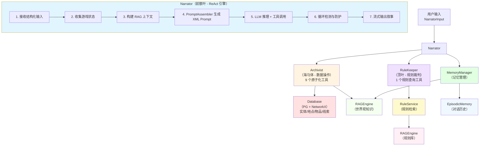

# Agents 模块架构说明

## 概述

Agents 模块是 GlyphKeeper 的**核心业务逻辑层**，采用**多智能体协作架构**，模拟人类大脑的不同功能区域，为COC跑团提供智能化的游戏主持能力。

## 设计哲学

### 🧠 脑科学隐喻

GlyphKeeper 的 Agent 架构受人类认知系统启发：

| Agent | 类比 | 职责 | 工具调用权 |
|-------|------|------|-----------|
| **Narrator** | 前额叶（决策中枢） | 叙事生成、意图识别、ReAct 推理 | ✅ 所有工具 |
| **Archivist** | 海马体（记忆存储） | 游戏状态管理、原子化数据操作 | ❌ 仅被调用 |
| **RuleKeeper** | 顶叶（规则处理） | CoC 7版规则查询与裁决建议 | ❌ 仅被调用 |

### 🎯 核心原则

1. **职责分离**：每个 Agent 职责单一且明确
2. **工具化接口**：所有能力通过 OpenAI Function Calling 暴露
3. **ReAct 模式**：Narrator 通过"推理-行动-观察"循环完成任务，支持多轮工具调用
4. **XML 结构化上下文**：使用 XML 标签组织 Prompt，增强 LLM 理解能力
5. **防护机制**：重复调用检测、最大迭代限制、循环防护

---

## 架构详解

### 1. Narrator - 叙事引擎 🎭

**文件**: [`narrator.py`](narrator.py)

#### 职责
- 接收玩家输入（通过 `NarratorInput` 结构化输入）
- 动态构建多层 Prompt（通过 `PromptAssembler`）
- 执行 ReAct 推理循环（支持多轮工具调用）
- 生成沉浸式的洛夫克拉夫特风格叙事
- 管理对话历史和记忆写入

#### 核心能力
```python
async def chat(
    user_input: NarratorInput,
    forced_scene_mode: Optional[SceneMode] = None
) -> AsyncGenerator[str, None]:
    """
    主对话循环：
    1. 收集游戏状态（会话、地点、调查员列表）
    2. 构建 RAG 上下文（语义记忆、情节记忆、守密人笔记）
    3. LLM 推理 + 多轮工具调用（ReAct）
    4. 流式输出叙事内容
    5. 循环防护（最大迭代限制、重复调用检测）
    """
```

#### 关键特性
- **多轮工具调用**：支持一次推理调用多个工具，支持工具调用后再次推理
- **循环防护**：
  - 硬性轮次限制（最多 5 轮工具调用）
  - 重复调用检测（检查最近 2 次调用签名）
  - 自动阻断无限循环并返回友好提示
- **LLM 追踪日志**：所有 LLM 调用记录到 `logs/llm_traces.jsonl`
- **结构化输入**：使用 `NarratorInput` 携带会话 ID、角色名、内容等信息

#### 工具箱
- **Archivist 工具**：9 个原子化数据操作工具
- **RuleKeeper 工具**：规则查询工具

#### NarratorInput 结构
```python
class NarratorInput(BaseModel):
    session_id: str         # 游戏会话 UUID
    character_name: str     # 当前行动角色名称
    content: str            # 玩家输入文本
    type: Literal["action", "dialogue", "ooc"] = "action"
```

---

### 2. Archivist - 数据守门人 📜

**文件**: [`archivist.py`](archivist.py)

#### 职责
- 封装所有数据库操作为**原子化工具**
- 提供 LLM 友好的 JSON 返回格式
- 维护游戏世界的绝对真实性
- 实现复杂逻辑（BFS 寻路、状态自动更新等）

#### 核心 API（9 个工具）

**游戏状态查询**
```python
async def get_game_session_stat(session_id: UUID) -> Dict
    # 返回时间段、节拍计数、全局标签等会话信息

async def list_investigators(session_id: UUID) -> Dict
    # 返回当前会话中所有调查员名称列表
```

**场景交互**
```python
async def get_location_stat(entity_name: str) -> Dict
    # 获取当前场景的完整信息：地点描述、出口、可交互物品、NPC、环境标签
    
async def inspect_target(viewer_name: str, target_name: str) -> Dict
    # 详细检查目标，可能触发线索发现（ClueDiscovery 机制）
```

**移动系统（双模式）**
```python
async def move_entity(entity_name: str, direction: str) -> Dict
    # 【战术移动】短距离移动到相邻出口，适用于密室探索、战斗

async def travel_to_location(entity_name: str, target_ref: str) -> Dict
    # 【叙事旅行】长距离移动，使用 BFS 自动寻路
    # - 支持路径阻挡检测（blocked/locked/sealed 标签）
    # - 返回旅行日志和中断原因
```

**状态管理**
```python
async def get_entity_status(entity_name: str) -> Dict
    # 返回实体属性（HP、SAN、MP、tags、完整 stats）

async def update_entity_resource(entity_name: str, resource: str, delta: int) -> Dict
    # 更新 HP/SAN/MP，自动处理：
    # - HP<=0 → 死亡标签
    # - HP 受伤 >= 最大值一半 → 重伤标签
    # - SAN<=0 → 永久疯狂
    # - SAN 损失 >= 5 → 临时疯狂
    # - SAN <= 最大值 * 4/5 → 不定性疯狂

async def add_entity_tag(entity_name: str, value: list) -> Dict
    # 批量添加状态标签，自动去重
```

**物品管理**
```python
async def transfer_item(item_name: str, from_container: str, to_container: str) -> Dict
    # 在实体/地点之间转移物品，验证当前位置
```

**记忆检索**
```python
async def recall_knowledge(entity_name: str, query: str) -> Dict
    # 通过 RAG 检索世界观知识（调用 RAGEngine）
```

#### 设计特点
- **原子性**：每个工具完成一个明确的操作
- **幂等性**：相同输入产生相同结果
- **防御性**：所有错误返回友好的 JSON 响应（`{"ok": False, "reason": "..."}`）
- **自动化逻辑**：BFS 寻路、状态阈值检测、标签自动管理

#### OpenAI Function Schema
```python
def get_openai_tools_schema() -> List[Dict]:
    """返回所有 9 个工具的 Function Calling 定义"""
```

---

### 3. RuleKeeper - 规则裁判 ⚖️

**文件**: [`rule_keeper.py`](rule_keeper.py)

#### 职责
- 通过 RAG 查询 CoC 7版规则书（使用 `RuleService`）
- 结合当前游戏情境给出裁决建议
- 防止 Narrator 凭空编造或混淆规则

#### 核心能力
```python
async def consult_rulebook(query: str, context_summary: str = "") -> str:
    """
    流程：
    1. 使用 RuleService.query_rule() 检索规则（hybrid 模式，top_k=60）
    2. LLM 结合上下文进行推理（使用 "standard" 级别模型）
    3. 返回简明的裁决建议
    """
```

#### 典型使用场景
- 玩家要求**孤注一掷**（Push the roll）
- 进入**战斗**（Combat）或**追逐**（Chase）
- **理智值损失**（SAN check）触发疯狂症状
- 使用**魔法**或怪异科技
- 不确定的规则判定

#### 工具定义
```python
{
    "name": "consult_rulebook",
    "description": "当玩家提及特殊机制（如孤注一掷、战斗、追逐、魔法）或你不确定规则判定时调用",
    "parameters": {
        "query": "具体的规则问题",
        "context_summary": "当前场景的简要描述"
    }
}
```

#### 依赖
- **RuleService**：统一的规则检索服务（使用延迟初始化）
- **LLM**：使用 "standard" 级别模型进行规则解释

---

### 4. PromptAssembler - 提示词构建器 🏗️

**文件**: [`tools/assembler.py`](tools/assembler.py)

#### 职责
- 实现**XML 结构化上下文**的动态 Prompt 生成
- 将游戏状态、记忆、历史整合为多层结构
- 支持场景模式切换和智能检测

#### 多层架构

Prompt 按照清晰的层次组织，使用 XML 标签分隔：

```xml
<系统指令层>
  核心法则：绝对真实、玩家自主权、洛夫克拉夫特风格、工具使用规范、规则裁决、内容安全
</系统指令层>

<world_state>
  <time_and_beat>时间段 | 节拍计数</time_and_beat>
  <location_data>地点描述、出口、物品、NPC、环境标签</location_data>
  <player_status>调查员状态</player_status>
  <active_tags>全局活跃标签</active_tags>
</world_state>

<knowledge_base>
  <lore>语义记忆（RAG 世界观知识）</lore>
  <history>情节记忆（重要剧情事件）</history>
  <keeper_notes>守密人笔记（隐藏线索）</keeper_notes>
</knowledge_base>

<conversation_history>
  最近 N 轮对话历史
</conversation_history>

<observation>
  刚执行的工具返回结果（如果有）
</observation>

<user_input>
  当前玩家输入
</user_input>
```

#### 场景模式 (SceneMode)
```python
class SceneMode(Enum):
    EXPLORATION = "exploration"      # 探索：强调感官细节和环境氛围
    COMBAT = "combat"                # 战斗：强调紧迫感和战术选择
    DIALOGUE = "dialogue"            # 对话：强调角色互动和情感
    INVESTIGATION = "investigation"  # 调查：强调线索推理和逻辑
```

#### 核心方法

```python
@classmethod
def build(
    cls,
    player_name: str,
    game_state: Dict,          # 包含时间、地点、调查员列表等
    rag_context: Dict,         # 包含 semantic、episodic、keeper_notes
    history_str: str,          # 格式化的对话历史
    user_input: str,
    tool_results: Optional[List[Dict]] = None,  # 工具调用结果
    scene_mode: Optional[SceneMode] = None      # 可选的场景模式
) -> str:
    """构建完整的系统 Prompt"""
    
    # 如果未指定场景模式，自动检测
    if scene_mode is None:
        scene_mode = cls._detect_scene_mode(user_input, game_state)
```

#### 关键特性
- **XML 结构化**：使用明确的标签分隔不同类型的上下文
- **动态模式切换**：根据玩家输入和游戏状态自动选择场景模式
- **YAML 格式化**：复杂数据结构使用 YAML 格式，提升 LLM 理解能力
- **内容安全规则**：明确定义了禁止生成的内容类型和处理策略

#### 模式检测逻辑
```python
def _detect_scene_mode(user_input: str, game_state: Dict) -> SceneMode:
    """
    根据关键词和游戏状态自动检测场景模式：
    - 包含"攻击"、"射击" → COMBAT
    - 包含"检查"、"搜索" → INVESTIGATION
    - 包含"询问"、"对话" → DIALOGUE
    - 默认 → EXPLORATION
    """
```

---

### 5. Tools - 工具集 🛠️

**目录**: [`tools/`](tools/)

#### schemas.py - 数据模型

**NarratorInput**：标准化的输入格式
```python
class NarratorInput(BaseModel):
    session_id: str          # 游戏会话 UUID
    character_name: str      # 当前行动角色
    content: str             # 玩家输入内容
    type: Literal["action", "dialogue", "ooc"] = "action"
    # action: 试图改变世界的行为（需要 ReAct 推理）
    # dialogue: 纯说话（简单记录或回应）
    # ooc: 场外话（如询问规则）
```

#### knowledge_service.py - 知识检索服务

**职责**：
- 为 RuleKeeper、MemoryManager 提供统一的 RAG 检索能力
- 支持多知识库（`domain="world"` 或 `domain="rules"`）
- 提供智能模式选择和人设模板

**核心 API**：
```python
class KnowledgeService:
    async def search(
        query: str,
        mode: str = "hybrid",       # local/global/hybrid
        smart_mode: bool = True,    # 自动选择模式
        persona: str = "chinese",   # 风格模板
        top_k: int = 60
    ) -> str
```

**人设模板**：
- `rule_judge`: 公正的规则裁判
- `lore_keeper`: 博学的历史学家（用于世界观）
- `game_narrator`: TRPG 叙事者
- `chinese`: 标准中文回答

**便捷函数**：
```python
await search_world("伊斯人的历史")   # 查世界设定
await search_rules("孤注一掷规则")    # 查游戏规则
```

---

## 调用关系图



### 数据流层级

1. **输入层**：`NarratorInput` 携带会话 ID、角色名、内容
2. **状态层**：从数据库收集当前游戏状态
3. **记忆层**：通过 RAG 检索相关知识和历史
4. **推理层**：LLM 基于 XML 结构化 Prompt 进行推理
5. **工具层**：调用 Archivist/RuleKeeper 工具执行操作
6. **输出层**：流式生成叙事内容

---

## 数据流示例

### 场景：玩家要求"孤注一掷"

```
1. 用户: "我不甘心！我要撞开这扇门！（孤注一掷）"
   输入格式: NarratorInput(
       session_id="550e8400-...",
       character_name="约翰·史密斯",
       content="我不甘心！我要撞开这扇门！（孤注一掷）",
       type="action"
   )
   ↓

2. Narrator: 收集游戏状态
   - 调用 Archivist.get_game_session_stat()
   - 调用 Archivist.list_investigators()
   - 调用 Archivist.get_location_stat("约翰·史密斯")
   ↓

3. Narrator: 构建 RAG 上下文
   - MemoryManager.build_prompt_context("我要撞开这扇门")
   - 返回：语义记忆（门的描述）、情节记忆（之前失败的尝试）、守密人笔记（隐藏信息）
   ↓

4. Narrator: 生成 XML Prompt
   - PromptAssembler.build() 检测到关键词"孤注一掷"
   - 在核心法则中强调：必须调用 consult_rulebook
   ↓

5. Narrator: LLM 第一轮推理
   - 识别到需要规则裁决
   - 返回工具调用请求：
     tool_calls = [{
         "function": {
             "name": "consult_rulebook",
             "arguments": {
                 "query": "孤注一掷的规则和后果",
                 "context_summary": "玩家试图撞门，上次力量检定失败"
             }
         }
     }]
   ↓

6. Narrator: 执行工具调用
   - 调用 RuleKeeper.consult_rulebook()
   ↓

7. RuleKeeper: 查询规则
   - RuleService.query_rule("孤注一掷", mode="hybrid", top_k=60)
   - RAG 检索 → 找到规则条目
   - LLM 推理 → 结合上下文判断
   ↓

8. RuleKeeper 返回:
   "允许孤注一掷。玩家描述了新手段（用身体撞）。
   ⚠️ 警告：失败将受伤或引来敌人。需要再次进行力量检定。"
   ↓

9. Narrator: 第二轮推理
   - 将工具结果加入 <observation> 标签
   - LLM 基于规则裁决生成叙事
   ↓

10. Narrator: 流式输出
    "你可以尝试孤注一掷。你后退几步，准备用肩膀猛撞这扇厚重的橡木门...
    但如果失败，巨响可能会引来那东西，而且你自己也会受伤。你确定吗？
    
    请进行【力量检定】。"
    ↓

11. Narrator: 记录到记忆
    - MemoryManager.add_dialogue("assistant", 生成的叙事)
    - EpisodicMemory 保存到数据库
```

### 场景：复杂移动（BFS 寻路）

```
1. 用户: "我要去图书馆"
   ↓

2. Narrator: 识别移动意图
   - 检测到"图书馆"是远距离地点
   - 选择工具：travel_to_location（而非 move_entity）
   ↓

3. Archivist: 执行 travel_to_location("约翰·史密斯", "图书馆")
   - 从数据库获取所有地点的 exits 信息
   - 构建导航图（邻接表）
   - BFS 算法计算最短路径
   - 检查路径中是否有阻挡（blocked/locked 标签）
   ↓

4. 假设路径：客厅 → 走廊 → 大厅 → 图书馆
   - 检查"走廊"：无阻挡，通过
   - 检查"大厅"：有 "police_line" 标签，阻挡！
   - 停止在"走廊"
   ↓

5. Archivist 返回:
   {
       "ok": True,
       "system_note": "旅行中断！试图前往大厅时受阻（状态：被封锁/锁住）。当前停留在：走廊。",
       "location_name": "走廊",
       "description": "狭窄的走廊...",
       ...
   }
   ↓

6. Narrator: 基于工具结果生成叙事
   "你快步走出客厅，穿过走廊。但当你试图进入大厅时，
   你看到黄色的警戒线封锁了入口。看来警方还在调查昨晚的事件。
   
   你现在站在走廊中，图书馆的路被堵住了。你打算怎么办？"
```

---

## 设计模式与最佳实践

### 1. ReAct (Reasoning + Acting)
- Narrator 先推理，再决定是否调用工具
- 支持多轮工具调用（最多 5 轮）
- 工具执行后，Narrator 重新生成叙事

### 2. XML 结构化上下文
- 使用 XML 标签明确分隔不同类型的信息
- 增强 LLM 对复杂上下文的理解能力
- 便于调试和追踪 Prompt 构建过程

### 3. 单一职责原则
- **Narrator**：叙事生成、流程控制、ReAct 推理
- **Archivist**：原子化数据操作、状态管理
- **RuleKeeper**：规则查询、裁决建议
- **PromptAssembler**：动态 Prompt 构建
- **MemoryManager**：记忆读写、RAG 检索

### 4. 循环防护机制
- **硬性轮次限制**：最多 5 轮工具调用，防止无限循环
- **重复调用检测**：记录最近 2 次工具调用签名，检测重复模式
- **友好提示**：检测到循环时返回建议，引导玩家换思路

### 5. 依赖倒置
- 所有 Agent 依赖抽象（工具接口）而非具体实现
- 便于测试和替换底层组件
- 清晰的数据流向，避免循环依赖

### 6. 幂等性与容错
- 所有工具调用都有清晰的成功/失败返回
- 失败不会导致系统崩溃，而是返回游戏内解释
- 使用 `{"ok": bool, "reason": str, ...}` 统一返回格式

### 7. 自动化与智能化
- **BFS 寻路**：自动计算最短路径，处理阻挡检测
- **状态阈值**：HP/SAN 变化自动触发状态标签更新
- **场景模式检测**：根据玩家输入自动切换叙事风格
- **线索发现机制**：检查物品时自动触发 ClueDiscovery 逻辑

### 8. 可观测性
- **LLM 追踪日志**：所有 LLM 调用记录到 `logs/llm_traces.jsonl`
- **日志分级**：debug/info/warning/error，便于排查问题
- **工具调用历史**：记录所有工具调用和返回结果

---

## 技术栈

- **编程语言**：Python 3.11+
- **异步框架**：asyncio + AsyncGenerator
- **数据库**：PostgreSQL (通过 SQLAlchemy)
- **图数据库**：NetworkX（用于地图导航）
- **LLM 接口**：OpenAI Function Calling
- **RAG 引擎**：LightRAG + PostgreSQL 向量存储
- **日志系统**：自定义 logger（基于 Python logging）

---

## 文件结构

```
src/agents/
├── __init__.py                 # 模块导出
├── narrator.py                 # 叙事引擎（核心）
├── archivist.py                # 数据守门人（9 个工具）
├── rule_keeper.py              # 规则裁判（1 个工具）
├── README.md                   # 本文档
└── tools/                      # 工具集
    ├── __init__.py
    ├── assembler.py            # Prompt 构建器
    ├── schemas.py              # 数据模型（NarratorInput）
    ├── knowledge_service.py    # 知识检索服务
    ├── db_tools.py             # [设计文档] 数据库工具封装
    └── dice_roller.py          # [设计文档] 掷骰子工具
```

---

## 使用示例

### 基础对话流程

```python
from src.agents import Narrator
from src.agents.tools import NarratorInput
from src.memory import MemoryManager

# 初始化
memory_manager = MemoryManager(session_id="550e8400-...")
narrator = Narrator(memory_manager)

# 构建输入
user_input = NarratorInput(
    session_id="550e8400-...",
    character_name="约翰·史密斯",
    content="我检查书桌上的日记本",
    type="action"
)

# 执行对话（流式输出）
async for chunk in narrator.chat(user_input):
    print(chunk, end="", flush=True)
```

### 强制场景模式

```python
from src.agents.tools import SceneMode

# 强制使用战斗模式
async for chunk in narrator.chat(user_input, forced_scene_mode=SceneMode.COMBAT):
    print(chunk, end="", flush=True)
```

### 调用 Archivist 工具（内部示例）

```python
from src.agents import Archivist

archivist = Archivist()

# 获取地点状态
result = await archivist.get_location_stat("约翰·史密斯")
print(result)
# {
#     "ok": True,
#     "location_name": "书房",
#     "description": "一个堆满书籍的房间...",
#     "exits": ["北", "东"],
#     "interactables": [{"name": "书桌", "tags": ["furniture"]}, ...],
#     "entities": [{"name": "猫咪", "tags": ["friendly"]}, ...],
#     ...
# }

# 移动实体
result = await archivist.move_entity("约翰·史密斯", "北")
print(result)
# 返回新地点的完整状态

# 长距离旅行
result = await archivist.travel_to_location("约翰·史密斯", "图书馆")
print(result)
# 自动寻路，返回旅行日志和最终地点
```

---

## 待办事项 (TODO)

从代码注释中提取的待实现功能：

### Narrator
- [ ] 规范输入格式
- [ ] 开幕描写生成
- [ ] 结团判断与结束描写
- [ ] 战斗轮与追逐轮处理

### Archivist
- [ ] 重伤状态的细化判断（急救 vs 医学处理）
- [ ] 潜在疯狂判断机制
- [ ] 不定性疯狂的完整逻辑

### Tools
- [ ] 实现掷骰与检定逻辑

### 系统级
- [ ] 多人模式支持
- [ ] NPC 互动工具（`interact_with_character`）
- [ ] 战斗系统完整实现
- [ ] 理智检定与疯狂症状自动化

