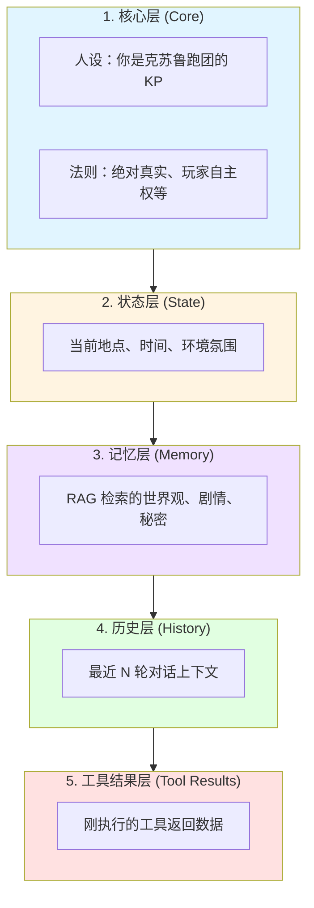
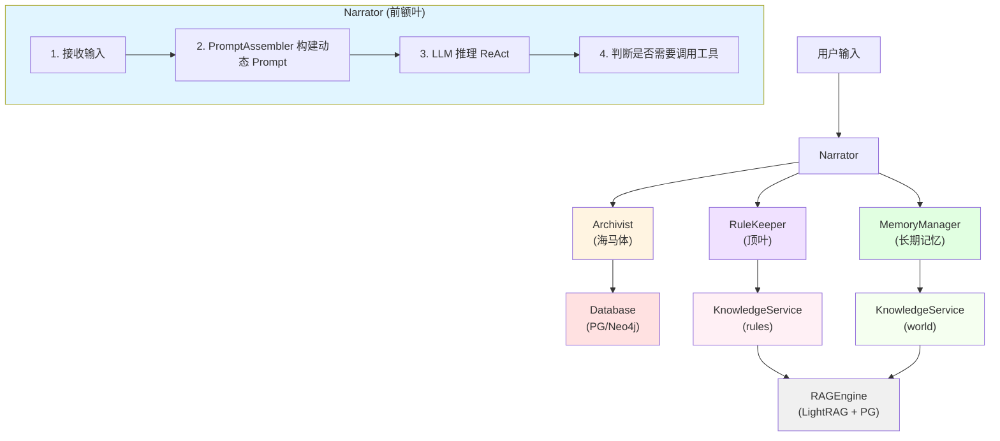

# Agents 模块架构说明

## 概述

Agents 模块是 GlyphKeeper 的**核心业务逻辑层**，采用**多智能体协作架构**，模拟人类大脑的不同功能区域，为COC跑团提供智能化的游戏主持能力。

## 设计哲学

### 🧠 脑科学隐喻

GlyphKeeper 的 Agent 架构受人类认知系统启发：

| Agent | 类比 | 职责 | 工具调用权 |
|-------|------|------|-----------|
| **Narrator** | 前额叶（决策中枢） | 叙事生成、意图识别、流程控制 | ✅ 所有工具 |
| **Archivist** | 海马体（记忆存储） | 游戏状态管理、实体操作 | ❌ 仅被调用 |
| **RuleKeeper** | 顶叶（规则处理） | 游戏规则查询、裁决建议 | ❌ 仅被调用 |

### 🎯 核心原则

1. **专人做专事**：每个 Agent 职责单一且明确
2. **工具化接口**：所有能力通过 OpenAI Function Calling 暴露
3. **ReAct 模式**：Narrator 通过"推理-行动-观察"循环完成任务
4. **分层架构**：清晰的依赖关系，避免循环依赖

---

## 架构详解

### 1. Narrator - 叙事引擎 🎭

**文件**: [`narrator.py`](narrator.py)

#### 职责
- 接收玩家输入，解析意图
- 构建动态 System Prompt（通过 `PromptAssembler`）
- 调用 Archivist 和 RuleKeeper 工具
- 生成沉浸式的洛夫克拉夫特式叙事

#### 核心能力
```python
async def chat(user_input: str) -> AsyncGenerator[str, None]:
    """
    主对话循环：
    1. 收集游戏状态（地点、时间、环境）
    2. 检索 RAG 记忆（世界观、剧情）
    3. LLM 推理 + 工具调用（ReAct）
    4. 生成流式叙事输出
    """
```

#### 工具箱
- **Archivist 工具**：操作游戏世界（移动、检查、互动等）
- **RuleKeeper 工具**：查询规则（孤注一掷、战斗、疯狂等）

---

### 2. Archivist - 数据守门人 📜

**文件**: [`archivist.py`](archivist.py)

#### 职责
- 封装所有数据库操作为**原子化工具**
- 提供 LLM 友好的 JSON 返回格式
- 维护游戏世界的绝对真实性

#### 核心 API（部分）
```python
async def move_entity(entity_name: str, target_location: str) -> Dict
async def get_location_view(entity_name: str) -> Dict
async def inspect_target(entity_name: str, target: str) -> Dict
async def interact_with_character(entity_name: str, npc_name: str) -> Dict
async def recall_knowledge(entity_name: str, query: str) -> Dict
```

#### 设计特点
- **幂等性**：相同输入总是产生相同结果
- **原子性**：每个工具完成一个明确的操作
- **防御性**：所有错误都返回友好的 JSON 响应

#### OpenAI Function Schema
```python
def get_openai_tools_schema() -> List[Dict]:
    """返回所有工具的 OpenAI Function Calling 定义"""
```

---

### 3. RuleKeeper - 规则裁判 ⚖️

**文件**: [`rule_keeper.py`](rule_keeper.py)

#### 职责
- 通过 RAG 查询 CoC 7版规则书
- 结合当前游戏情境给出裁决建议
- 防止 Narrator 凭空编造或混淆规则

#### 核心能力
```python
async def consult_rulebook(query: str, context_summary: str = "") -> str:
    """
    流程:
    1. 使用 KnowledgeService 检索规则库
    2. LLM 结合上下文进行推理
    3. 返回简明的裁决建议
    """
```

#### 典型使用场景
- 玩家要求"孤注一掷"（Push the roll）
- 进入战斗（Combat）或追逐（Chase）
- 理智值损失（SAN check）触发疯狂症状
- 使用魔法或怪异科技

#### 工具定义
```python
{
    "name": "consult_rulebook",
    "description": "当玩家提及特殊机制或你不确定规则判定时调用",
    "parameters": {
        "query": "规则问题（如'孤注一掷的条件'）",
        "context_summary": "当前场景的简要描述"
    }
}
```

---

### 4. PromptAssembler - 提示词构建器 🏗️

**文件**: [`assembler.py`](assembler.py)

#### 职责
- 实现**融合架构**的动态 Prompt 生成
- 将游戏状态、记忆、历史整合为五层结构

#### 五层架构



#### 场景模式 (SceneMode)
```python
class SceneMode(Enum):
    EXPLORATION = "exploration"      # 探索：强调感官细节
    COMBAT = "combat"                # 战斗：强调紧迫感
    DIALOGUE = "dialogue"            # 对话：强调角色互动
    INVESTIGATION = "investigation"  # 调查：强调线索推理
```

---

### 5. Tools - 工具集 🛠️

**目录**: [`tools/`](tools/)

#### knowledge_service.py - 知识检索服务

**职责**：
- 为 RuleKeeper、MemoryManager 提供统一的 RAG 检索能力
- 支持多知识库（`domain="world"` 或 `domain="rules"`）
- 提供智能模式选择和人设模板

**核心 API**：
```python
class KnowledgeService:
    async def search(
        query: str,
        mode: str = "hybrid",       # local/global/hybrid
        smart_mode: bool = True,    # 自动选择模式
        persona: str = "chinese",   # 风格模板
        top_k: int = 60
    ) -> str
```

**人设模板**：
- `rule_judge`: 公正的规则裁判
- `lore_keeper`: 博学的历史学家（用于世界观）
- `game_narrator`: TRPG 叙事者
- `chinese`: 标准中文回答

**便捷函数**：
```python
await search_world("伊斯人的历史")   # 查世界设定
await search_rules("孤注一掷规则")    # 查游戏规则
```

---

## 调用关系图



---

## 数据流示例

### 场景：玩家要求"孤注一掷"

```
1. 用户: "我不甘心！我要撞开这扇门！（孤注一掷）"
   ↓
2. Narrator: 识别关键词 "再试一次"
   ↓
3. Narrator: 调用工具 consult_rulebook(
       query="孤注一掷的规则和后果",
       context_summary="玩家试图撞门，上次力量检定失败"
   )
   ↓
4. RuleKeeper:
   - KnowledgeService.search("孤注一掷的规则", domain="rules")
   - RAG 检索 → 找到规则条目
   - LLM 推理 → 结合上下文判断
   ↓
5. RuleKeeper 返回:
   "允许孤注一掷。玩家描述了新手段（用身体撞）。
   ⚠️ 警告：失败将受伤或引来敌人。"
   ↓
6. Narrator: 基于工具结果生成叙事
   "你可以尝试孤注一掷。你后退几步，准备用肩膀猛撞...
   但如果失败，巨响可能会引来那东西。你确定吗？"
```

---

## 设计模式与最佳实践

### 1. ReAct (Reasoning + Acting)
- Narrator 先推理，再决定是否调用工具
- 工具执行后，Narrator 重新生成叙事

### 2. 单一职责原则
- Narrator：叙事与流程控制
- Archivist：数据操作
- RuleKeeper：规则查询

### 3. 依赖倒置
- 所有 Agent 依赖抽象（工具接口）而非具体实现
- 便于测试和替换底层组件

### 4. 幂等性与容错
- 所有工具调用都有清晰的成功/失败返回
- 失败不会导致系统崩溃，而是返回游戏内解释

---
