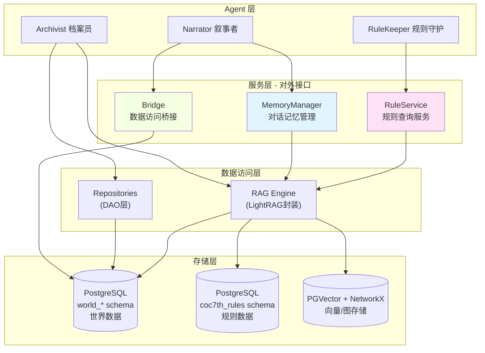

# Memory Module (记忆模块)

## 简介

Memory 模块是 GlyphKeeper 的核心组件，负责维护游戏世界的**持久化状态**。它旨在解决传统 LLM 应用中的"灾难性遗忘"和"逻辑不一致"问题。

本模块采用了仿生学的**双脑架构 (Bicameral Architecture)**，将游戏记忆分为理性的"左脑"和感性的"右脑"：

1.  **左脑 (Left Brain) - 理性与规则**：
    *   负责处理**结构化数据 (Structured Data)**。
    *   管理客观的游戏事实，如：位置坐标、物品栏清单、角色属性数值、开关状态。
    *   **特点**：精确、逻辑严密、基于规则。存储在 PostgreSQL 关系型数据库中。

2.  **右脑 (Right Brain) - 感性与记忆**：
    *   负责处理**非结构化数据 (Unstructured Data)**。
    *   管理模糊的叙事体验，如：场景的氛围描述、NPC 的过往经历、模组的背景故事、发生的历史事件。
    *   **特点**：模糊、联想丰富、基于语义。存储在基于 LightRAG 的向量/图数据库中。

---

## 架构概览



---

## 核心组件

### 1. 服务层 (Service Layer) - 对外接口

Memory 模块提供三个主要的对外接口，各司其职：

#### 1.1 MemoryManager (对话记忆管理器)
**职责**：管理对话记录的录入、固化和上下文构建
- **文件**：[manager.py](manager.py)
- **主要功能**：
  - `add_dialogue()`: 添加对话记录
  - `_consolidate()`: 定期将对话固化为摘要，存入 RAG
  - `build_prompt_context()`: 为 Narrator 构建检索上下文
- **使用者**：Narrator、主流程
- **适用场景**：需要处理对话记忆时

#### 1.2 RuleService (规则查询服务)
**职责**：提供 COC7th 规则数据的查询接口
- **文件**：[rule_service.py](rule_service.py)
- **主要功能**：
  - `query_rule()`: 查询规则知识库
  - `insert_rule_document()`: 插入规则文档
- **使用者**：RuleKeeper Agent、规则导入脚本
- **特点**：使用独立的 `coc7th_rules` schema，与世界数据完全隔离
- **适用场景**：需要查询游戏规则时

#### 1.3 Bridge (数据访问桥接)
**职责**：提供通用的、基于字典的数据访问接口，屏蔽 ORM 细节
- **文件**：[bridge.py](bridge.py)
- **主要功能**：
  - `fetch_model_data()`: 获取模型数据（返回字典）
  - `save_model_data()`: 保存模型数据（创建或更新）
  - `transaction_context()`: 事务上下文管理器
- **使用者**：Components（如 DiceRoller、HealthSystem）、需要直接操作数据库的模块
- **适用场景**：需要简单的 CRUD 操作，不想处理 ORM 复杂性时

---

### 2. 数据访问层 (Data Access Layer)

#### 2.1 Repositories (仓储层)
**职责**：提供类型安全的 CRUD 接口和业务逻辑封装
- **文件夹**：[repositories/](repositories/)
- **主要类**：
  - `BaseRepository`: 通用增删改查基类
  - `LocationRepository`: 地点数据访问
  - `EntityRepository`: 实体（NPC/调查员）数据访问
  - `InteractableRepository`: 交互物数据访问
  - `ClueDiscoveryRepository`: 线索发现数据访问
  - `KnowledgeRepository`: 知识注册表数据访问
  - `SessionRepository`: 游戏会话数据访问
  - `InvestigatorProfileRepository`: 调查员档案数据访问
- **使用者**：Archivist Agent、需要复杂查询的模块
- **适用场景**：需要面向对象的数据访问、复杂关联查询时

#### 2.2 RAG Engine (检索增强生成引擎)
**职责**：基于 LightRAG 的语义检索和知识插入
- **文件**：[RAG_engine.py](RAG_engine.py)
- **主要功能**：
  - `query()`: 执行语义检索（支持 local/global/hybrid/naive 模式）
  - `insert()`: 插入文档到知识库
  - 支持多 workspace 隔离（world_* 和 rules）
- **存储后端**：
  - Vector：PGVector (PostgreSQL)
  - KV：PostgreSQL
  - Graph：NetworkX
- **使用者**：MemoryManager、RuleService、KnowledgeService
- **适用场景**：需要语义检索、上下文召回时

---

### 3. 存储层 (Storage Layer)

#### 3.1 左脑：结构化记忆 (PostgreSQL)

##### 数据库架构设计
- **Workspace 隔离**：每个世界使用独立 schema（如 `world_the_haunting`）
- **规则数据隔离**：规则数据存储在独立的 `coc7th_rules` schema
- **自动 Schema 切换**：通过 `search_path` 实现，由 `active_world` 配置控制

##### 核心数据模型

**物理层 (Physical Layer)**
- **`Location`** (地点表)：场景及其连接关系
  - `id`, `key`, `name`, `base_desc`, `tags`, `exits`
  - 关联：`interactables`, `entities`

- **`Interactable`** (交互物表)：物品、容器
  - `id`, `key`, `name`, `tags`, `state`
  - 位置互斥：`location_id` 或 `carrier_id`
  - 支持状态切换和携带者转移

- **`Entity`** (实体表)：NPC、怪物、调查员
  - `id`, `key`, `name`, `location_id`, `tags`, `stats`, `attacks`
  - 关联：`location`, `inventory`, `dialogue_links`, `profile`
  - 虚拟装备系统：通过 `inventory` 关联 Interactable

**逻辑层 (Logic Layer)**
- **`InvestigatorProfile`** (调查员档案)：扩展 Entity 的调查员专属信息
  - 基础信息：`player_name`, `occupation`, `age`, `gender`, `residence`, `birthplace`
  - 背景故事：`backstory` (JSONB)
  - 资产描述：`assets_detail`
  - 一对一关联 Entity

- **`Knowledge`** (知识注册表)：线索的逻辑开关
  - `id`, `rag_key`, `tags_granted`
  - 指向 LightRAG 中的具体内容

- **`ClueDiscovery`** (线索发现中间层)：实现 N:N 映射
  - 来源：`interactable_id` 或 `entity_id`（互斥）
  - 目标：`knowledge_id`
  - 触发条件：`required_check` (JSONB)
  - 情境描述：`discovery_flavor_text`

**控制层 (Control Layer)**
- **`GameSession`** (游戏会话)：全局状态管理
  - `id`, `status`, `scenario_name`, `time_slot`, `beat_counter`
  - `active_global_tags`, `investigator_ids`, `opening`

- **`Event`** (事件表)：状态转换规则
  - `trigger_condition`, `effect_script`

**记忆层 (Memory Layer)**
- **`DialogueRecord`** (对话记录)：原始对话存档
  - `investigator_id`, `turn_number`, `role`, `content`
  - `is_consolidated`: 是否已固化标记
  
- **`MemoryTrace`** (记忆痕迹)：对话摘要索引
  - `summary`, `start_turn`, `end_turn`, `tags`, `importance_score`
  - 连接原始对话与 RAG 检索

#### 3.2 右脑：非结构化记忆 (LightRAG)

**存储架构**
- **Vector Store**: PGVector (存储在 PostgreSQL 的 `public` schema)
- **KV Store**: PostgreSQL Table
- **Graph Store**: NetworkX (内存图 + 持久化序列化)

**内容类型**
- **世界设定 (Semantic Memory)**: 模组背景、NPC 历史、场景描述
- **游戏事件 (Episodic Memory)**: 对话摘要、玩家行动、剧情进展
- **规则文档 (Rules Memory)**: COC7th 规则、判定表、技能说明

---

## 关键概念

### 单一事实来源 (Single Source of Truth)
LLM 的 Context Window 仅作为"工作记忆"，所有的长期状态必须持久化到数据库中。
*   **错误做法**：让 LLM 记住"玩家有一把钥匙"。
*   **正确做法**：在 `Inventory` 表中插入一条记录，LLM 需要时查询数据库。

### Tag 系统 (The Tag System)
Tag 是连接结构化数据与非结构化叙事的桥梁。
*   **结构化**：Entity 表中有 `tags=["injured"]`。
*   **非结构化**：RAG 检索时，会将 `injured` 作为上下文注入，检索出"受伤后的行为模式"或"痛苦的呻吟声"等描述。

### 线索发现机制 (Clue Discovery Mechanism)
放弃了“物品直接包含线索”的一对一模式，引入 `ClueDiscovery` 中间层实现多对多映射。
*   **复用性**：多个物理载体（如尸体、血字）可指向同一个逻辑真相 (`Knowledge`)。
*   **情境区分**：同一个真相，从不同来源获取时，拥有不同的检定难度 (`required_check`) 和 发现描述 (`discovery_flavor_text`)。

---

## 使用示例

### 1. 查询地点信息 (结构化)

```python
from src.memory.database import get_db
from src.memory.repositories.location_repo import LocationRepository

async for session in get_db():
    repo = LocationRepository(session)
    loc = await repo.get_by_name("Library")
    print(f"Location: {loc.name}, Exits: {loc.exits}")
```

### 2. 记录游戏事件 (非结构化)

```python
from src.memory.episodic_memory import EpisodicMemory

memory = EpisodicMemory()
# 记录事件，并关联相关 Tag
await memory.insert_game_event(
    event_text="玩家试图撬开宝箱，但触发了毒针陷阱。",
    related_tags=["trap_triggered", "poisoned"]
)
```

### 3. 检索上下文 (混合)

```python
# 基于当前情境（如：玩家中毒）检索相关记忆
context = await memory.retrieve_context(
    query="我现在感觉如何？",
    context_tags=["poisoned"]
)
print(context) 
# 可能输出：你感到头晕目眩，伤口处传来阵阵麻痹感... (来自 RAG 检索)
```
