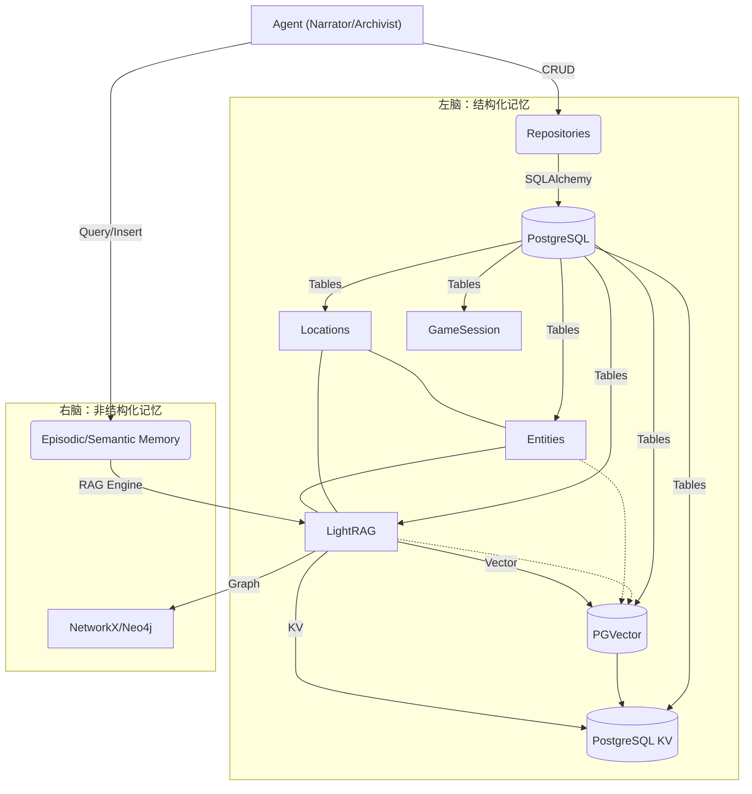

# Memory Module (记忆模块)

## 简介

Memory 模块是 GlyphKeeper 的核心组件，负责维护游戏世界的**持久化状态**。它旨在解决传统 LLM 应用中的"灾难性遗忘"和"逻辑不一致"问题。

本模块采用了仿生学的**双脑架构 (Bicameral Architecture)**，将游戏记忆分为理性的"左脑"和感性的"右脑"：

1.  **左脑 (Left Brain) - 理性与规则**：
    *   负责处理**结构化数据 (Structured Data)**。
    *   管理客观的游戏事实，如：位置坐标、物品栏清单、角色属性数值、开关状态。
    *   **特点**：精确、逻辑严密、基于规则。存储在 PostgreSQL 关系型数据库中。

2.  **右脑 (Right Brain) - 感性与记忆**：
    *   负责处理**非结构化数据 (Unstructured Data)**。
    *   管理模糊的叙事体验，如：场景的氛围描述、NPC 的过往经历、模组的背景故事、发生的历史事件。
    *   **特点**：模糊、联想丰富、基于语义。存储在基于 LightRAG 的向量/图数据库中。

---

## 架构概览



---

## 核心组件

### 1. 左脑：结构化记忆 (Structured Memory)

负责管理精确的游戏规则数据，确保逻辑的一致性。

*   **Models (`models.py`)**: 定义了数据库表结构。
    *   `Location`: 地点及其连接关系。
    *   `Entity`: NPC、怪物及其属性，包含战斗数据与虚拟装备。
    *   `Interactable`: 纯粹的物理容器与逻辑锚点，支持持有权转移（在场景中或在角色身上）。
    *   `ClueDiscovery`: **(新增)** 中间层，连接物理实体与逻辑知识，定义发现条件与情境描述。
    *   `Knowledge`: 纯逻辑开关，指向 LightRAG 中的具体内容。
    *   `GameSession`: 全局游戏状态（时间、节拍）。
*   **Repositories (`repositories/`)**: 数据访问层 (DAO)，提供类型安全的 CRUD 接口。
    *   `BaseRepository`: 通用增删改查。
    *   `TaggableRepository`: 支持 Tag 操作的基类。
    *   `LocationRepository`, `EntityRepository`, `ClueDiscoveryRepository` 等：特定实体的业务逻辑。

### 2. RAG 引擎 (RAG Engine)

基于 [LightRAG](https://github.com/HKUDS/LightRAG) 实现的图谱增强检索系统，作为连接左右脑的桥梁。

*   **`RAG_engine.py`**: 单例模式的引擎封装。负责初始化 LightRAG，配置存储后端（PostgreSQL + NetworkX）。
*   **`storage.py`**: 存储配置管理。目前使用 PostgreSQL 作为 KV 和 Vector 存储，NetworkX 作为 Graph 存储。

### 3. 右脑：高级记忆接口

*   **情景记忆 (`episodic_memory.py`)**:
    *   记录游戏过程中发生的动态事件（"你打开了门"，"守卫被激怒了"）。
    *   支持 **Metadata Injection**：将结构化 Tag（如 `[TAG: angry]`）注入到文本中，增强检索的相关性。
*   **语义记忆 (`semantic_memory.py`)**:
    *   存储模组的静态设定、风味文本、背景故事。
    *   同样支持元数据注入，用于实现基于条件的知识检索。

---

## 关键概念

### 单一事实来源 (Single Source of Truth)
LLM 的 Context Window 仅作为"工作记忆"，所有的长期状态必须持久化到数据库中。
*   **错误做法**：让 LLM 记住"玩家有一把钥匙"。
*   **正确做法**：在 `Inventory` 表中插入一条记录，LLM 需要时查询数据库。

### Tag 系统 (The Tag System)
Tag 是连接结构化数据与非结构化叙事的桥梁。
*   **结构化**：Entity 表中有 `tags=["injured"]`。
*   **非结构化**：RAG 检索时，会将 `injured` 作为上下文注入，检索出"受伤后的行为模式"或"痛苦的呻吟声"等描述。

### 线索发现机制 (Clue Discovery Mechanism)
放弃了“物品直接包含线索”的一对一模式，引入 `ClueDiscovery` 中间层实现多对多映射。
*   **复用性**：多个物理载体（如尸体、血字）可指向同一个逻辑真相 (`Knowledge`)。
*   **情境区分**：同一个真相，从不同来源获取时，拥有不同的检定难度 (`required_check`) 和 发现描述 (`discovery_flavor_text`)。

---

## 使用示例

### 1. 查询地点信息 (结构化)

```python
from src.memory.database import get_db
from src.memory.repositories.location_repo import LocationRepository

async for session in get_db():
    repo = LocationRepository(session)
    loc = await repo.get_by_name("Library")
    print(f"Location: {loc.name}, Exits: {loc.exits}")
```

### 2. 记录游戏事件 (非结构化)

```python
from src.memory.episodic_memory import EpisodicMemory

memory = EpisodicMemory()
# 记录事件，并关联相关 Tag
await memory.insert_game_event(
    event_text="玩家试图撬开宝箱，但触发了毒针陷阱。",
    related_tags=["trap_triggered", "poisoned"]
)
```

### 3. 检索上下文 (混合)

```python
# 基于当前情境（如：玩家中毒）检索相关记忆
context = await memory.retrieve_context(
    query="我现在感觉如何？",
    context_tags=["poisoned"]
)
print(context) 
# 可能输出：你感到头晕目眩，伤口处传来阵阵麻痹感... (来自 RAG 检索)
```
